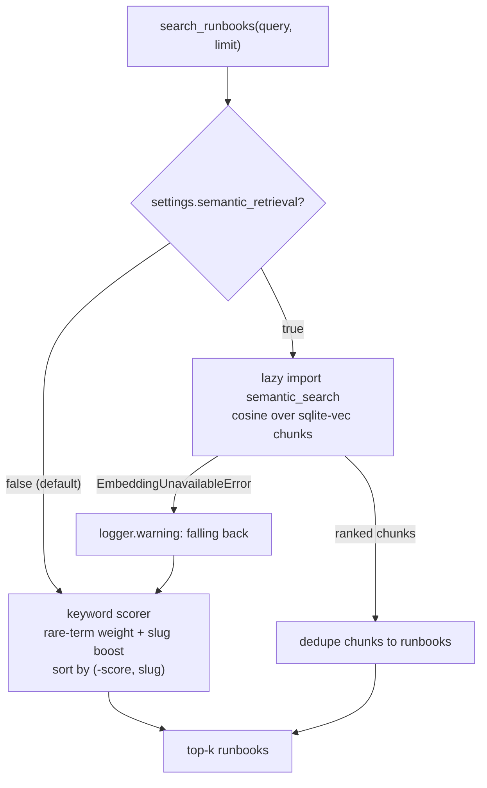
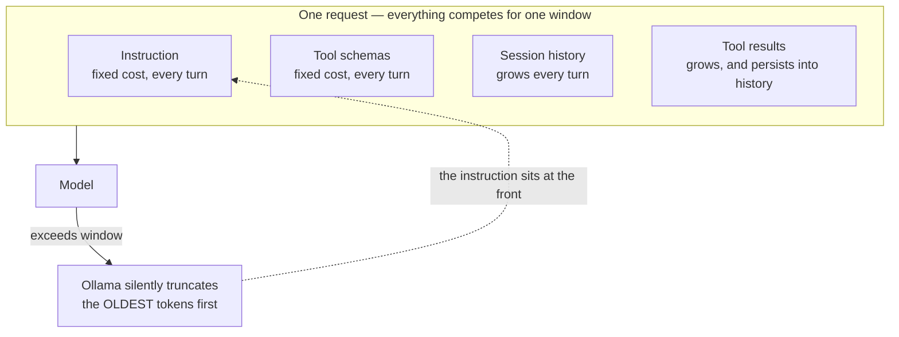

# 3.4. Memory

!!! abstract "In one glance"

    - **You will:** Tell the agent's five kinds of memory apart, watch runbook retrieval pick a document, and learn why a long conversation quietly loses its own rules.
    - **You need:** [3.1. Tools](./3.1.%20Tools.md) finished; `mise run doctor:model` passing if you want to run the retrieval evaluation.
    - **Time:** about 32 minutes, reference.

## What does "memory" mean in this course?

You close the terminal and ask the same question tomorrow: which of these five stores still knows the answer?

The word covers five stores that should not be conflated:

| Store             | Scope                               | Implementation               |
| ----------------- | ----------------------------------- | ---------------------------- |
| Conversation      | One user/session                    | ADK `DatabaseSessionService` |
| A2A task          | One network task                    | `DatabaseTaskStore`          |
| Operational state | Services, incidents, audit          | Writable SQLite copy         |
| Long-term notes   | One stable user id, across sessions | SQLite in `.state/memory.db` |
| Knowledge         | Remediation procedures              | Immutable Markdown runbooks  |

Each row has a different scope, owner, and lifecycle, and confusing two of them is the classic memory bug. A note saved for one user is not knowledge the whole team can read, and an A2A task is not a conversation.

This page covers long-term memory and knowledge retrieval. A **runbook** — a committed Markdown procedure for one failure mode — is not automatically trusted simply because it is stored locally; its content is still data the model must cite and policy must constrain.

This page has two halves. The first covers the five stores and how a runbook is fetched, scored, and evaluated. The second is [the one context window](#what-is-actually-inside-my-agents-context-window) they all compete for, because storing memory and spending the window that holds it are two different problems.

## What should an agent remember across sessions?

Facts the next conversation needs and cannot recompute: the incident under investigation, remediation already attempted, and outcome notes. In-session history dies with the session, and runbook retrieval only knows the knowledge base.

[`longterm.py`](https://github.com/MLOps-Courses/agentops-open-course/blob/main/agents/python/src/agent/longterm.py) gives the AgentOps Agent two tools — `save_incident_note` and `recall_incident_context` — backed by a small SQLite table in the disposable state directory. Notes are isolated per user and pass PII redaction before persisting:

```python
# Memory is a persistence boundary: redact before the write, not after the read.
redacted = redact_persisted_text(cleaned)
```

Memory is a data store like any other: it never touches the seed dataset, and `mise run data:reset` clears it along with the rest of the runtime state.

The cross-session boundary depends on a stable `ToolContext.user_id`. The default unauthenticated A2A adapter derives `A2A_USER_<context-id>`, so a new A2A context is a new logical user and cannot recall the previous context's notes. A browser reload in the minimal client is enough to cross that line.

A shared or production client must authenticate the caller and propagate a durable subject before treating this store as human-level long-term memory.

## Why make memory explicit tools instead of automatic?

Silent context stuffing hides reads and writes from everyone debugging the agent. As tools, every recall and save appears in the trace, can be audited, and can be tested deterministically offline.

Explicit tools also keep the boundaries inspectable. Input validation runs at the tool edge, before anything is written:

- `normalize_incident_id` parses the id, so only a well-formed value reaches the store.
- A referential check refuses to attach a note to an unknown incident — "refusing to create orphaned memory".
- A length cap and an empty-note check reject the rest.

The redaction step above is then a visible policy, not a hope. The cost is that the model must decide to call `recall_incident_context`: the tool docstring tells it to do so at the start of an investigation, and trajectory evaluation is where you verify it does.

## How is a known runbook fetched?

An incident carries a validated runbook slug. The tool normalizes it before any path lookup:

```python
--8<-- "agents/python/src/agent/memory.py:get-runbook"
```

The exact excerpt is build-checked against [`memory.py`](https://github.com/MLOps-Courses/agentops-open-course/blob/main/agents/python/src/agent/memory.py). `normalize_slug` permits only lowercase alphanumeric kebab-case, and only the trusted `normalized` value reaches the data layer. `../../secret` never becomes a filesystem path.

`get_runbook` and `search_runbooks` ship together as `KNOWLEDGE_TOOLS`, each wrapped in `with_resilience` — the same bounded-deadline-and-retry policy the read tools get, safe here because a runbook read is idempotent.

The same two functions are also two of the six read-only tools re-exposed over the governed MCP route ([3.3. MCP](./3.3.%20MCP.md)), so one implementation serves the in-process agent and any external MCP client without a second copy to drift.

A runbook is plain Markdown split by `##` headings, and `high-latency` has four: Symptoms, Diagnosis, Remediation, and Related. Here is its Remediation section — `INC-001` and `INC-005` both point at this slug, and this is the part the agent quotes when it recommends a fix:

```markdown
## Remediation

- If a recent deploy correlates, **roll back** to the previous version (see `deployment-rollback`).
- Warm or repair the cache if hit-rate collapsed.
- Scale out replicas to shed load while you find the root cause.
- Raise connection-pool limits if the pool is the bottleneck.
```

??? note "Deeper: the high-latency runbook in full"

    Here is one runbook whole — `high-latency`, the slug `INC-001` and `INC-005` point at. Its four `##` headings (Symptoms / Diagnosis / Remediation / Related) are exactly what the retrieval chunker splits on ([`chunk_runbook`](#when-do-embeddings-beat-keyword-retrieval) below) and what the agent cites when it recommends a fix:

    ```markdown
    # Runbook: High Latency

    **Applies to:** a service whose request latency (p95/p99) has risen well above its normal baseline while still returning successful responses.

    ## Symptoms

    - p95 or p99 latency several times higher than the 7-day baseline.
    - Timeouts or slow responses reported by downstream callers.
    - Error rate usually normal (requests succeed, just slowly).

    ## Diagnosis

    1. Check whether the spike lines up with a recent **deploy** or config change.
    2. Inspect CPU, memory, and thread/goroutine counts for saturation.
    3. Look at **downstream dependencies** (database, cache, third-party APIs) for slow calls.
    4. Check cache **hit-rate**; a cold or thrashing cache is a common cause after a rebuild.
    5. Review connection-pool and queue depths for contention.

    ## Remediation

    - If a recent deploy correlates, **roll back** to the previous version (see `deployment-rollback`).
    - Warm or repair the cache if hit-rate collapsed.
    - Scale out replicas to shed load while you find the root cause.
    - Raise connection-pool limits if the pool is the bottleneck.

    ## Related

    - `deployment-rollback` — reverting a bad release.
    - `elevated-errors` — when latency is accompanied by failures.
    ```

The `remediation` skill's "follow that runbook's Remediation section" ([3.2. Skills](./3.2.%20Skills.md#how-is-a-skill-different-from-a-runbook)) refers to the section you see here — the runbook supplies the incident-specific what, the skill the reusable how.

## How does free-text retrieval work?

`search_runbooks` scores every runbook against the words in your query, with no model involved. The scoring is deterministic and **TF-IDF-style**: a term counts for more when it is rare across the runbooks.

The scorer, in the order it runs:

- Drop tokens shorter than three characters.
- Count how many documents contain each term.
- Weight rare terms more highly than ubiquitous terms.
- Add a strong boost when a term matches the runbook slug.
- Sort by score descending, then slug ascending for stable ties.

```python
scored.sort(key=lambda row: (-row[0], row[1]))
```

The result is inspectable, fast, cheap, and reproducible. It is intentionally not described as semantic search — that is the opt-in branch below.

## When do embeddings beat keyword retrieval?

When queries paraphrase the documents instead of quoting them — an engineer types "checkout is slow" while the runbook says "high latency". Whether that matters for _this_ corpus is a measurement, not a fashion choice: enable semantic retrieval only if the evaluation below shows it beating the keyword baseline on this dataset.

An **embedding** is a vector representation of text, so a search can match meaning instead of exact words ([0.7. Glossary](../0.%20Overview/0.7.%20Glossary.md#embedding)).

The implementation in [`retrieval.py`](https://github.com/MLOps-Courses/agentops-open-course/blob/main/agents/python/src/agent/retrieval.py) stays minimal and account-free. `sqlite-vec`, a SQLite extension for vector search, stores runbook-chunk vectors in the state directory, and the `nomic-embed-text` model runs through the local Ollama embeddings endpoint. Chunking — splitting each document into smaller passages — is heading-bounded, so each vector covers one procedure step or symptom block:

```python
def chunk_runbook(slug: str, content: str) -> list[str]:
    """Split one runbook into heading-bounded chunks, each prefixed with its slug."""
    pieces = [piece.strip() for piece in _HEADING.split(content) if piece.strip()]
    return [f"{slug}: {piece}" for piece in pieces] or [f"{slug}: {content.strip()}"]
```

The option is off by default (`AGENT_SEMANTIC_RETRIEVAL=false`), which keeps the offline test gate deterministic and model-free. `search_runbooks` reads that one flag and branches: the keyword scorer above, or a lazily-imported `semantic_search` so the default path never loads the vector stack.

The fallback is explicit, not silent. An `EmbeddingUnavailableError` (endpoint down, model unpulled, mismatched batch) is caught, logged at warning, and answered by the same keyword scorer:



Own the failure modes before trusting the upgrade:

- An empty result set.
- A confidently-wrong nearest neighbor: cosine distance measures how closely two vectors point the same way, so it always returns _something_.
- The endpoint outage above.

## How do I evaluate retrieval quality?

The dataset grades itself: every incident already names its runbook, so the ground truth needs no hand labeling. **Hit-rate@k** is the fraction of incidents whose runbook appears in the retriever's top k results.

[`evals/retrieval_eval.py`](https://github.com/MLOps-Courses/agentops-open-course/blob/main/agents/python/evals/retrieval_eval.py) builds a query from each incident's title and summary, scores both retrievers at k=1 and k=3, logs the comparison to MLflow, and prints a verdict.

This is the only command on the page that needs a model running, so it has two prerequisites: `mise run doctor:model` passing, and the embedding model pulled with `ollama pull nomic-embed-text`.

```bash
cd agents/python
mise run eval:retrieval
```

!!! warning "What a failing run looks like"

    Without that model the run stops with `Embeddings unavailable at http://127.0.0.1:11434 with model 'nomic-embed-text'`, because the evaluation calls `semantic_search` directly and has no fallback of its own. The agent is unaffected: `search_runbooks` catches the same error, logs it, and answers from the keyword scorer.

The first CPU request may need to load the embedding weights from disk. `AGENT_EMBEDDING_TIMEOUT_S` bounds that cold start separately (120 seconds by default), so ordinary MCP tools retain their tighter deadline.

Measured checkpoint (2026-07-12, dataset commit `ad4854b`, Ollama 0.31.2, `nomic-embed-text` blob `sha256:970aa74c0a90`):

| Retriever | hit-rate@1 | hit-rate@3 |
| --------- | ---------- | ---------- |
| Keyword   | 1.00       | 1.00       |
| Semantic  | 0.80       | 1.00       |

On these ten incident queries, semantic retrieval loses at k=1 and only matches at k=3. The evidence therefore supports the shipped default: keep semantic retrieval disabled for this small, vocabulary-aligned corpus. Re-run the checkpoint when the incidents, runbooks, chunking, or embedding model changes; this snapshot is a versioned observation, not a universal ranking claim.

```python
def hit_rate(retrieve, k: int) -> float:
    """Fraction of incidents whose runbook appears in the retriever's top-k."""
    pairs = cases()
    hits = sum(expected in retrieve(query, k) for query, expected in pairs)
    return hits / len(pairs)
```

The semantic side calls the local embeddings endpoint, so this evaluation stays outside the offline test gate. Set `AGENT_SEMANTIC_RETRIEVAL=true` only if the semantic hit rate beats the keyword baseline here.

And remember what you now own: embedding model/version, chunking, index rebuilds, deletion, poisoning defenses, and re-running this evaluation when the corpus changes.

## How do you defend against retrieval injection?

A retrieved runbook is data, not instruction. Six rules keep a poisoned document from steering the agent:

- Index only reviewed sources and preserve provenance.
- Treat retrieved instructions as lower priority than system/runtime policy.
- Never let a runbook expand the tool allowlist or self-approve an action.
- Return/cite the source slug so a human can inspect it.
- Bound result count and content size.
- Include malicious or contradictory documents in adversarial tests.

## What is actually inside my agent's context window?

Four things share one window, and every one of them is sent again on every turn.

Everything above is about storing memory; this is the half about spending the window that holds it. The runtime assembles the whole request, and on the local path the window is the modest usable context of Qwen3-4B through Ollama. For the AgentOps Agent, one request is composed of:

| Component       | Source                                                                     |
| --------------- | -------------------------------------------------------------------------- |
| Instruction     | The committed `INSTRUCTION` (or a pinned registry version)                 |
| Tool schemas    | ADK derives a declaration from every tool's signature and docstring        |
| Session history | Every prior turn, replayed by `DatabaseSessionService`                     |
| Tool results    | Runbook markdown, log lines, notes, and skill bodies returned this session |



The tool schemas are easy to underestimate: on the default local path the agent registers a dozen tools (four reads, two knowledge, two guarded actions, two memory, two skill tools). Each docstring you write for the model is prompt text on every single turn. Tool results are the other heavyweight — `search_runbooks` returns up to three whole runbooks as markdown, and once returned they live on in the session history.

The two fixed costs are paid on turn one and never go away; the two growing ones are what eventually push you over the edge. Note the direction of the failure: truncation drops the **oldest** tokens, and your instruction is the oldest thing there. That is why a long conversation degrades precisely into an agent that has forgotten its own rules.

## How do I measure tokens per component?

Per turn, you do not have to guess. The after-model callback in [`budget.py`](https://github.com/MLOps-Courses/agentops-open-course/blob/main/agents/python/src/agent/budget.py) reads `usage_metadata` from each response and accumulates it in session state.

It emits the running totals as `agentops.tokens.session.*` span attributes, plus an `agentops.tokens` counter that Prometheus scrapes. Watching `prompt_token_count` grow turn over turn shows exactly how fast history accumulates. The same telemetry backs cost attribution in [7.3. Costs](../7.%20Observability/7.3.%20Costs.md).

Per component, there is no shipped breakdown. Measure it yourself: change one thing at a time and compare the first turn's input-token count.

??? note "Deeper: three one-variable experiments"

    Hold one question constant (`What is the status of the checkout service?`), change one component, and compare the input tokens of the first turn:

    1. Switch the six read/knowledge tools between local and the MCP route (`AGENT_MCP_URL`) to see the schema cost of each toolset.
    1. Shorten one tool docstring and diff the input count.
    1. Ask a question that triggers `search_runbooks` versus one answered by a single status read to see retrieval weight.

    Reset state between measurements (`mise run data:reset`), and remember the gateway streaming path reports no usage — measure on the default non-streaming path.

## What do I drop first when I run out?

Three levers, in order of least behavioral risk first, all demonstrable on the local stack:

1. **Retrieval width.** `search_runbooks(query, limit=3)` returns whole documents; the model rarely needs three runbooks to cite one. Lowering `limit` is the direct lever. Note the semantic option does _not_ help here: it ranks heading-bounded chunks internally but still returns each match's full runbook via `read_runbook(slug)`. Switching retrievers does not shrink what enters the window; only `limit` does.
1. **Tool schema weight.** Terser docstrings and fewer registered tools shrink every turn. Note that routing reads through MCP does not make their schemas free — discovered declarations still enter the context; the saving comes only from what you stop exposing.
1. **Session history.** The course ships no automatic _summarizer_, but `AGENT_MAX_HISTORY_MESSAGES` provides an automatic deterministic _trim_ ([next section](#how-do-you-bound-the-history-automatically)). The complementary deliberate lever needs no configuration: end the session, after saving durable findings with `save_incident_note`, and let `recall_incident_context` carry them into the fresh session. That is long-term memory used as explicit history compression. Skills already apply the same idea: `list_skills` shows only names and descriptions until `load_skill` pulls one body in.

Every cut trades against quality: a terser docstring can cost a correct tool choice, a smaller `limit` can drop the right runbook. The eval set in [4.4. Evaluations](../4.%20Quality/4.4.%20Evaluations.md) is the check — re-run the trajectory scores after each reduction and treat a drop as the real price of the tokens you saved. The `eval:cost` tripwire in that chapter is the matching guard for the opposite direction: it flags a change that quietly _inflates_ tokens.

## How do you bound the history automatically?

The levers above are deliberate — you end a session or tune a limit by hand. `AGENT_MAX_HISTORY_MESSAGES` adds an automatic one for a session that must stay live.

It is a `before_model_callback`, meaning code ADK runs just before each model call. This one keeps only the most recent messages and replaces the older span with a single synthetic note. It is off by default (unset sends the full history), deterministic, and model-free, so the offline test gate stays exact:

```python
--8<-- "agents/python/src/agent/compaction.py:compact-history"
```

It sits between the token budget and PII redaction in the callback chain, so a refused call does no work and redaction only ever runs on the messages that survive. The rewrite is ephemeral — ADK rebuilds the request from the stored session events every turn, so nothing is deleted from the session and no marker ever accumulates.

Two properties keep it safe as a default. It never leaves behind an _orphaned_ tool result — a `function_response` whose matching call was dropped, which the model cannot interpret. It also trims rather than summarizes, so no extra model call is involved.

??? note "Deeper: why those two properties matter"

    Two properties keep it safe as a teaching default:

    1. **It never opens the window on an orphaned tool result.** If the cut would land on a `function_response` whose matching `function_call` was already dropped, it advances past it, so the model never sees a result with no call.
    1. **It is a trim, not a summary.** The elided span becomes one note recording how many messages were dropped and which tools they touched — not a model-generated summary. That is what keeps it deterministic and free; summarizing the dropped span with the model is the natural extension, traded against an extra model call per compaction and lost determinism.

Because a single user turn can expand into several messages (a model tool call, a tool response, a model answer), set the budget with headroom. Confirm with the token telemetry above that the input count now plateaus instead of climbing every turn.

## Why does my agent silently forget the start of a long conversation?

Because the model's advertised maximum and the serving window are two different numbers. `ollama show qwen3:4b-instruct` prints the architecture's context length, but the Ollama server applies its own configured window — a few thousand tokens by default unless `OLLAMA_CONTEXT_LENGTH` raises it.

When the composed prompt (instruction, tool schemas, full history, tool results) exceeds that window, Ollama truncates the oldest tokens and answers anyway. The agent process receives no error, only a model that has lost the earliest content. Since the instruction sits at the front, a long session can shed the operating rules themselves, so grounding and approval discipline degrade exactly when the conversation is longest.

Detect it locally: the per-session input-token attributes from the telemetry above keep climbing while the Ollama server log reports the truncation, and behavior drifts (uncited claims, forgotten constraints from early turns). Fix it explicitly, with any of four levers:

- Raise `OLLAMA_CONTEXT_LENGTH` to what your hardware's memory allows.
- Shrink the context with the levers above.
- Bound the history with `AGENT_MAX_HISTORY_MESSAGES` so old turns are trimmed to a note instead of silently truncated.
- Set `AGENT_MAX_TOKENS_PER_SESSION` so a session ends with an actionable message before it degrades silently.

!!! warning "Common mistakes"

    - **Conflating the five stores.** Treating conversation, A2A task, operational state, long-term notes, and knowledge as one "memory" is the classic memory bug — each has a different scope, owner, and lifecycle in the table above, and reasoning about one as if it were another is where the confusion starts.
    - **Trusting a runbook because it is local.** A runbook stored in the repository is still data the model must cite and policy must constrain, never trusted instruction — index only reviewed sources and treat retrieved text as lower priority than system and runtime policy.
    - **Assuming the context window is unbounded.** The instruction, tool schemas, history, and tool results all compete for one finite serving window; exceed it and Ollama silently drops the oldest tokens — including your operating rules — with no error.

## How would you add an eighth runbook and re-measure retrieval?

Exercise: grow the knowledge base, then check that retrieval still finds the right document.

- **Goal**: add one runbook to the seven in `agents/data/runbooks/`, point an incident at it, and confirm the keyword scorer still returns the right runbook for every incident.
- **Files to touch**: a new `agents/data/runbooks/<slug>.md` with the same `##` headings as the existing files, the incident's `runbook` value in `agents/data/sql/seed.sql`, and a new case in `agents/python/tests/test_memory.py`.
- **Rebuild the seed**: `cd agents/data && mise run build`, then `mise run check` — it fails if any incident names a runbook file that does not exist.
- **Gate that proves completion**: `cd agents/python && uv run pytest tests/test_memory.py` passes with a case asserting your slug is the top hit for a query phrased in its own words. With the embedding model pulled, `mise run eval:retrieval` should still print `keyword_hit_rate_at_1: 1.00`.

## What proves this page worked?

```bash
cd agents/python
uv run pytest tests/test_memory.py tests/test_longterm.py tests/test_retrieval.py
```

Verify exact-slug lookup, deterministic tie ordering, no-match behavior, non-positive limit handling, path traversal rejection, per-user note isolation, redaction before persistence, and the keyword fallback when embeddings are unavailable. Then manually compare the top result for `database connection pool exhausted` with the runbook source.

That subset also prints `FAIL Required test coverage of 95% not reached`, because the coverage gate is measured over the whole suite. `mise run test` is the run that has to be green.

**You are done when:**

- Every test in the three files above passes.
- `get_runbook` refuses a traversal slug: `test_get_runbook_rejects_path_traversal` passes, and the tool returns an `error` listing the available runbooks instead of file content.
- The top result for `database connection pool exhausted` matches, line for line, a file you can open under `agents/data/runbooks/`.
- You can say which of the five stores in the first table holds a given fact, and what `AGENT_MAX_HISTORY_MESSAGES` changes about the prompt.

Continue to [3.5. Workflows](./3.5.%20Workflows.md) when you can name, for any fact the agent needs, which of the five stores is supposed to hold it.
