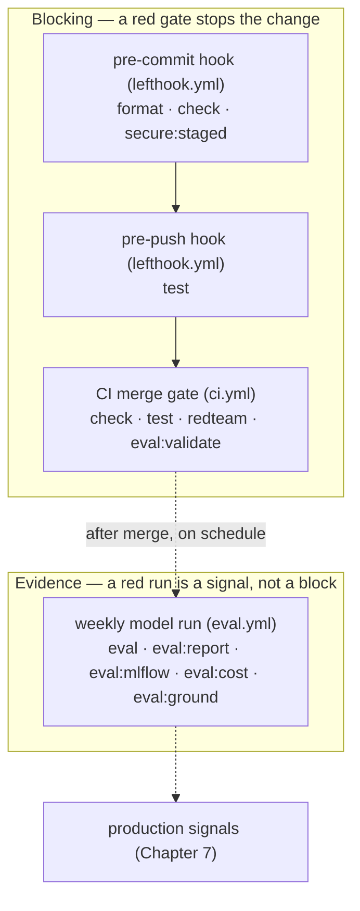

# 4. Quality

!!! abstract "In one glance"

    - **You will:** See how the seven quality gates in this chapter fit together, and which ones block a merge versus which ones only inform you.
    - **You need:** Chapter 3 finished and `mise run test` passing.
    - **Time:** about 5 minutes, orientation.

## How will you make the agent trustworthy?

Trust comes in layers. Each page below adds one, and each layer catches a class of failure the cheaper layers below it cannot.

Your agent now holds a conversation ([Chapter 2](../2. Agents/)) and has bounded capabilities ([Chapter 3](../3. Capabilities/)). This chapter makes it defensible.

Four of these pages run entirely offline, with no account and no bill. The marker on each line says what that page's own checkpoint needs; run `mise run doctor:model` before a model-backed one.

- **[4.0. Typing](./4.0. Typing.md)** _(concept · offline)_: Python typing with ty, parsing tool I/O at the boundary.
- **[4.1. Linting](./4.1. Linting.md)** _(hands-on · offline)_: Lint and format with ruff and dprint.
- **[4.2. Testing](./4.2. Testing.md)** _(hands-on · offline)_: Fast, offline unit tests with pytest, against an isolated dataset copy.
- **[4.3. Metrics](./4.3. Metrics.md)** _(reference · needs a model)_: A concrete scorecard of release gates and observed operational indicators.
- **[4.4. Evaluations](./4.4. Evaluations.md)** _(hands-on · needs a model)_: ADK trajectories plus full-conversation MLflow lineage and optional judge evidence.
- **[4.5. Guardrails](./4.5. Guardrails.md)** _(hands-on · offline, except the last checkpoint step)_: Boundary redaction, stable errors, confirmation, transactions, and audit evidence.
- **[4.6. Security](./4.6. Security.md)** _(hands-on · offline)_: Threat modeling, offline adversarial regressions, identity, and supply-chain scanning.

Two pages end in a hands-on build step, so expect to write code, not just read. [4.4. Evaluations](./4.4. Evaluations.md) has you add an eval case, and [4.5. Guardrails](./4.5. Guardrails.md) has you turn a guardrail into a test that fails if it ever weakens.

## Where does each quality gate run?

The same `mise run` tasks execute at three different moments, and the moment decides whether a red result blocks you or just informs you:



The rule is short. The local hooks and the CI **merge gate** — the check a change must pass before it can merge — block a change; the weekly model run only informs.

??? note "Deeper: which task runs in which workflow"

    1. **Local hooks (`lefthook.yml`)** run the fast, offline gates before code leaves your machine: `format` and `check` (typing, lint, docs, links, licenses) plus `secure:staged` on commit, then `test` on push.
    1. **The CI merge gate (`.github/workflows/ci.yml`)** re-runs the same `check` and `test` on a clean runner and adds two named signals — the deterministic `redteam` suite and offline `eval:validate` — so a regression blocks the merge instead of hiding in one line of the full log. Every gate above this point is offline: no model, no provider key, no cost.
    1. **The weekly model-backed workflow (`.github/workflows/eval.yml`, Monday 07:00 UTC or manual dispatch)** is the only tier that calls a model; it provisions a local Ollama server on the runner and runs `eval`, `eval:report`, `eval:mlflow`, `eval:cost`, and `eval:ground` against the fixed seed data. It is scheduled evidence, never a PR gate: a failed run points you at uploaded artifacts to inspect, not at a blocked merge.

So the chapter stays model-free until [4.3. Metrics](./4.3. Metrics.md) explicitly asks for a configured provider; everything before it runs with no account and no bill.

Be equally clear about the ceiling. Three things prove less than their names suggest: the `redteam` suite, the optional MLflow judge, and the audit trail. A green interactive demo cannot substitute for any of these gates.

??? note "Deeper: what these gates do not prove"

    The `redteam` suite is a deterministic offline regression, not live model red-teaming; the optional MLflow judge is advisory evidence with no enforced pass threshold unless a release policy sets one; and the audit trail is an append-only SQLite log on a writable volume, not an externally immutable or externally shipped sink.

## What proves this chapter worked?

Two offline commands cover the chapter: the full test suite, then the adversarial regression suite.

```bash
cd agents/python
mise run test
mise run redteam
```

Neither needs a model, a provider key, or a network.

**You are done when:**

- `mise run test` passes, including the enforced 95% branch-coverage floor.
- `mise run redteam` passes every adversarial case in `tests/test_security.py`.
- You can name which moments block a change (the local hooks, the CI merge gate) and which one only reports (the weekly model run).
- You can say which pages ahead need a configured model and which run offline.

Continue to [4.0. Typing](./4.0.%20Typing.md) when you can tell a gate that blocks a merge from a run that only produces evidence.
