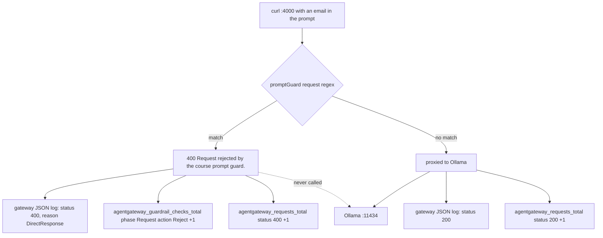
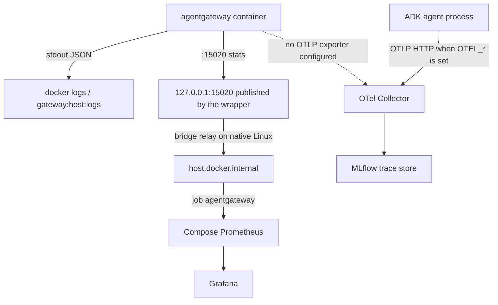
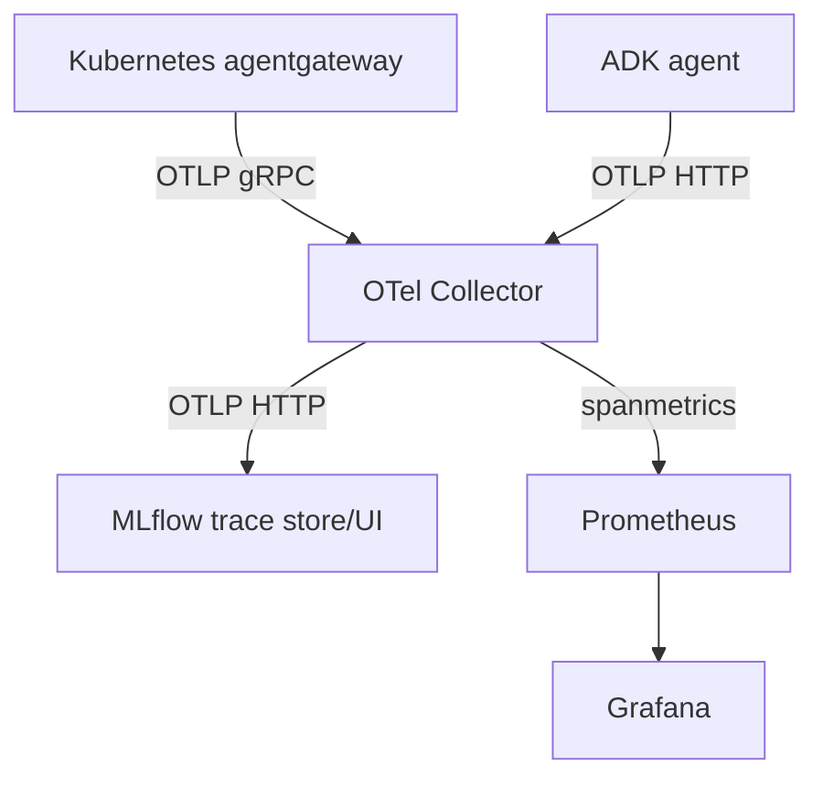

# 5.6. Gateway Observability

!!! abstract "In one glance"

    - **You will:** Send one rejected request and find it three times: in the gateway's JSON log, in its metrics counter, and as an absence in MLflow.
    - **You need:** The gateway from [5.1. Gateway Setup](./5.1.%20Gateway%20Setup.md) running plus `mise run observability:up` started.
    - **Time:** about 30 minutes, hands-on.

## Which gateway signals are available?

The gateway sees every request, including the ones it rejects before any upstream runs. That makes gateway telemetry different in kind from application telemetry: the agent process cannot report a call it never received, and a 400 produced by a policy exists only in the gateway's own signals.

Three signals ship here:

1. **Structured JSON logs** on standard output in every profile. `config.logging.format: json` is the first block of all four configs ([host](https://github.com/MLOps-Courses/agentops-open-course/blob/main/infra/agentgateway/host/config.yaml), host auth, [k3d](https://github.com/MLOps-Courses/agentops-open-course/blob/main/infra/agentgateway/k3d/config.yaml), gke), so log shape does not change as you move profiles.
1. **Prometheus metrics** on internal port `15020` in every profile. On the host, `infra/scripts/gateway-host.sh` injects `.config.statsAddr = "0.0.0.0:15020"` into the rendered config and publishes it on `127.0.0.1:15020`. In Kubernetes, the same port is a named `metrics` container port on the Deployment and a port on the ClusterIP Service.
1. **[OTLP](../0.%20Overview/0.7.%20Glossary.md#otlp) gateway traces** in the k3d and GKE profiles only, whose in-cluster collector is part of the deployment. OTLP is the OpenTelemetry wire protocol a process uses to push telemetry to a collector.

The host gateway deliberately leaves OTLP disabled so the optional Compose stack can be down without exporter retries. Host application traces are still available when the agent's `OTEL_*` variables are set. Kubernetes gateways export to `otel-collector.agentops.svc.cluster.local:4317`.

This page covers what the gateway itself emits and where it lands. The dashboard panels, alert rules, Loki queries (Loki is the log store in the same Compose stack), and measured latency numbers built on top of these signals belong to [7.2. Monitoring](../7.%20Observability/7.2.%20Monitoring.md).

## What does a rejected request look like across all three signals?

Do this before reading further: send one request the gateway refuses, then go find it. This is the exercise that teaches gateway observability, because it is the one case where the signals must disagree.

With the host gateway from [5.1. Gateway Setup](./5.1.%20Gateway%20Setup.md#how-do-you-start-the-host-data-plane) running, send the prompt-guard curl from [5.5. Gateway Security](./5.5.%20Gateway%20Security.md#how-does-the-prompt-guard-work). The email address in the prompt is what trips the guard:

```bash
curl -i http://localhost:4000/v1/chat/completions \
  -H 'Content-Type: application/json' \
  -d '{
    "model": "qwen3:4b-instruct",
    "messages": [{"role": "user", "content": "Email jane.doe@example.com"}]
  }'
```

Expected status: `400`, before Ollama is called. Now read the counter that rejection just moved:

```bash
curl -fsS http://localhost:15020/metrics | grep agentgateway_guardrail_checks_total
```

After your first rejection since the gateway started, the line reads:

```text
agentgateway_guardrail_checks_total{phase="Request",action="Reject"} 1
```

Send the curl again and re-read the counter. If the number does not move, your request never reached the policy you think it did — a wrong port, a wrong listener, or an unrendered config change.

Here is the whole path, including the branch you did not take:



Three positive signals, one absence. The absence is the diagnostic: Ollama is never called, so no completion, no token usage, and — when the caller is the agent rather than curl — no successful model span in MLflow.

`reason="DirectResponse"` in both the log line and the metric labels is the gateway saying so explicitly. You can prove the reject-before-backend property with a stronger test than reading a config: stop Ollama entirely, then send the email prompt. It still returns `400`, because the guard runs before any backend hop.

The rest of the page takes those signals one at a time: the metric names, the log line, and the plumbing that carries both to Prometheus.

## Which metric names should you actually look for?

`:15020/metrics` returns hundreds of series, and three metric families carry the request-level story:

- `agentgateway_requests_total` — how many requests the gateway handled, labelled by `status`, `listener`, and `protocol`.
- `agentgateway_request_duration_seconds_bucket` — how long they took, as histogram buckets (a count of requests under each latency threshold).
- `agentgateway_guardrail_checks_total` — how many requests a policy rejected: the counter you just watched move.

Most of the rest are runtime gauges (`agentgateway_tokio_*`, `agentgateway_process_*`, `agentgateway_config_synchronized`). Useful for a crash investigation, useless for answering "is the data plane healthy".

??? note "Deeper: the three dashboard expressions (Chapter 7 uses these)"

    Three families carry the request-level story, and they are exactly the three the course's Grafana dashboard pins ([`infra/observability/grafana/dashboards/agentops.json`](https://github.com/MLOps-Courses/agentops-open-course/blob/main/infra/observability/grafana/dashboards/agentops.json)):

    ```promql
    sum(rate(agentgateway_requests_total[5m]))
    histogram_quantile(0.95, sum by (le) (rate(agentgateway_request_duration_seconds_bucket[5m])))
    sum(rate(agentgateway_guardrail_checks_total{action="Reject"}[5m]))
    ```

    Rate, tail latency, and policy rejections. Those are PromQL expressions, the query language Prometheus reads; [7.2. Monitoring](../7.%20Observability/7.2.%20Monitoring.md) is where you build panels on them.

The raw series behind the first and third of those families, captured on the host profile after one prompt-guard rejection:

```text
agentgateway_requests_total{backend="/default/default/bind/4000/llm/default/route0/backend0",protocol="llm",method="POST",status="400",reason="DirectResponse",bind="bind/4000",gateway="default/default",listener="llm",route="default/route0",route_rule="unknown"} 1
agentgateway_guardrail_checks_total{phase="Request",action="Reject"} 1
```

Read the labels: every dimension is bound by your configuration (`bind`, `listener`, `route`, `backend`, `protocol`, `method`, `status`, `reason`), never by the caller or the prompt. That is why these series are safe to keep at high resolution, and why [7.2. Monitoring](../7.%20Observability/7.2.%20Monitoring.md#why-avoid-session-or-prompt-labels) can refuse user, session, and trace-id labels without losing the operational picture. `protocol="llm"` distinguishes model traffic from `mcp` and `a2a` on the other binds, so one expression can be split per listener.

`agentgateway_guardrail_checks_total` is the only place where a policy decision becomes a number. Its `phase` label separates the request guard (`phase="Request"`, the email/override regex, status 400) from the response guard (`phase="Response"`, status 502) configured in [5.5. Gateway Security](./5.5.%20Gateway%20Security.md#how-does-the-prompt-guard-work). Without it, a rejection is indistinguishable from a client-side bug: both look like a 400 to the caller.

A pitfall worth internalizing: `agentgateway_requests_total` counts what the gateway handled, not what the model did. A rejected request increments it with `status="400"` and `reason="DirectResponse"` — the gateway answered directly. Do not build a "model call rate" panel on this counter; use the agent's own `agentops_calls_total` for that.

## What does one gateway log line contain?

Your rejected request left one line behind. Here is one real request line from the host profile, produced by the same rejected model request from [5.5. Gateway Security](./5.5.%20Gateway%20Security.md#how-does-the-prompt-guard-work).

The gateway writes it as a single line of JSON; it is wrapped here so the fields are readable:

```text
{
  "level": "info",
  "time": "2026-07-17T14:45:37.407581Z",
  "scope": "request",
  "gateway": "default/default",
  "listener": "llm",
  "route": "default/route0",
  "endpoint": "host.docker.internal:11434",
  "src.addr": "172.17.0.1:45434",
  "http.method": "POST",
  "http.host": "localhost",
  "http.path": "/v1/chat/completions",
  "http.version": "HTTP/1.1",
  "http.status": 400,
  "protocol": "llm",
  "reason": "DirectResponse",
  "duration": "0ms"
}
```

Four things to notice:

1. **`scope` selects the line's kind.** `scope: request` is the access log; startup lines carry `agentgateway::proxy::gateway` or `agent_core::readiness` instead. Filter on it before anything else: `mise run gateway:host:logs | grep '"scope":"request"'`.
1. **The routing decision is in the line.** `listener`, `route`, `endpoint`, and `protocol` tell you which config block matched, which is the fastest way to prove a request went where you think it did. If `endpoint` is not the upstream you expect, the bug is in the config, not the agent.
1. **`reason` explains the status.** `DirectResponse` means the gateway itself produced the body without a backend hop — with `http.status:400` and `protocol:"llm"`, that is a prompt-guard rejection. A 400 forwarded from Ollama would show a real upstream reason instead.
1. **No prompt, no response, no caller identity.** The line carries metadata only, and `src.addr` is Docker's bridge address (`172.17.0.1`), not the original client — the gateway runs in a container and sees the connection from the host bridge. Correlation therefore relies on time plus these request attributes, not on an identifier the line does not have.

Log format is a contract, not a convenience. JSON on stdout means the container runtime captures it, a collector can parse it without regexes, and field names stay stable across the four profiles.

Fields were read from agentgateway `v1.3.1` on the host profile; they are the current shape, not a stability guarantee from upstream. Verify before writing a parser against them.

## How do you inspect raw metrics?

With the host gateway:

```bash
curl -fsS http://localhost:15020/metrics | head -n 20
```

That gives you the endpoint. Getting Prometheus to read it is a separate question, with one wrinkle worth knowing before you debug it.

Prometheus runs in Compose; the gateway publishes `15020` on loopback only. The `host.docker.internal` target is what bridges the two, and it is precisely why the native-Linux wrapper relays the metrics port alongside the MCP, A2A, and model upstreams ([5.1. Gateway Setup](./5.1.%20Gateway%20Setup.md#how-do-you-start-the-host-data-plane)).

If Compose Prometheus shows the `agentgateway` target as down, run `mise run smoke:host` — it isolates the bridge path from the rest of your stack.

??? note "Deeper: how the scrape is wired, in Compose and in Kubernetes"

    The scrape is a separate question, and the answer is pinned in [`infra/observability/prometheus.yml`](https://github.com/MLOps-Courses/agentops-open-course/blob/main/infra/observability/prometheus.yml):

    ```yaml
    scrape_configs:
      - job_name: otel-collector
        static_configs:
          - targets: [otel-collector:8889]
      - job_name: mlflow
        metrics_path: /metrics
        static_configs:
          - targets: [mlflow:5000]
      - job_name: agentgateway
        static_configs:
          - targets: [host.docker.internal:15020]
    ```

    `scripts/smoke-host.sh` closes that loop deterministically: it curls `/metrics` from the host, then curls `http://host.docker.internal:<metrics port>/metrics` again from a throwaway container on the default bridge, asserting a Prometheus exposition line in both.

    In Kubernetes, the port is not public. Forward it only while diagnosing:

    ```bash
    kubectl -n agentops port-forward svc/agentgateway 15020:15020
    ```

    There, the in-cluster collector scrapes the service directly with its own `prometheus/agentgateway` receiver targeting `agentgateway:15020`, and re-exports the result on `:8889` — so cluster Prometheus only ever scrapes the collector ([`infra/k8s/base/otel-collector-config.yaml`](https://github.com/MLOps-Courses/agentops-open-course/blob/main/infra/k8s/base/otel-collector-config.yaml)). One less scrape target to authorize through a NetworkPolicy.

## Why does the host gateway expose metrics but not traces?

Metrics are pulled, traces are pushed. A scrape target that nobody scrapes costs the gateway nothing. An OTLP exporter is a client with a connection, a queue, and a retry loop, and it fails noisily whenever its collector is absent.

The host observability stack is optional (`mise run observability:up`). Configuring `tracing.otlpEndpoint` there would make the default quickstart log exporter errors for a service the learner was never asked to start. The k3d and GKE configs do set it, because their collector is deployed in the same manifest set.



The dashed edge is the deliberate gap: on the host, gateway spans do not exist, and only the agent's own spans reach MLflow. Do not spend an afternoon looking for a gateway hop in a host trace.

The same wrapper that turns the metrics surface on turns the debug surface off. `render_base_config` sets three fields together:

```text
.config.statsAddr = "0.0.0.0:15020" |
.config.readinessAddr = "0.0.0.0:15021" |
.config.adminAddr = "off"
```

See [`gateway-host.sh`](https://github.com/MLOps-Courses/agentops-open-course/blob/main/infra/scripts/gateway-host.sh), and `scripts/check-infra.sh` asserts all three on the rendered output so the trio cannot drift.

The distinction is the point of the exercise. Metrics and readiness are read-only, bounded, and consumed by a machine. An admin interface is an unauthenticated control surface on a process that holds your policies. Observability does not require it, so it is not exposed — even on loopback, even in a lab. If you need it while developing agentgateway itself, turn it on knowingly and locally, not by default.

## How do traces reach MLflow?

In the cluster the gateway also exports traces; on the host it does not, so on this page a gateway hop never appears in MLflow.



The collector batches traces, applies a memory limiter, exports them to the self-hosted MLflow service, and exposes span-derived RED metrics (rate, errors, duration) for Prometheus to scrape. Chapter 7 inspects the implementation.

??? note "Deeper: sampling, when you get to the cluster (Chapter 6)"

    How many gateway spans should you expect? The k3d and GKE configs pair the endpoint with a sampler:

    ```yaml
    tracing:
      otlpEndpoint: http://otel-collector.agentops.svc.cluster.local:4317
      randomSampling: true
    ```

    `randomSampling` governs requests that arrive **without** an existing trace context: it accepts a ratio between `0.0` and `1.0` or a boolean, and defaults to `false`. Left at the default, the gateway would only extend traces a caller already started, and a plain `curl` through the gateway would produce nothing. Set to `true`, every unparented request starts a span — which is what you want in a course cluster where you send single requests and expect to see them. It is not what you want at production volume: that is where a ratio, not a boolean, belongs, and where you should decide once whether the gateway or the application is the sampling authority. Two independent samplers on one request path produce half-traces.

## Are prompts stored in traces?

No. The agent opts out explicitly rather than relying on library defaults, in `setup_telemetry()`:

```python
# Content capture is opt-in: traces retain timing, model, tool, token, and
# status metadata without duplicating user prompts or model responses.
os.environ.setdefault("ADK_CAPTURE_MESSAGE_CONTENT_IN_SPANS", "false")
os.environ.setdefault("OTEL_INSTRUMENTATION_GENAI_CAPTURE_MESSAGE_CONTENT", "false")
```

That default matters more than it looks. Trace content capture is the single highest-risk default in any GenAI stack: it turns an operational store into a copy of every prompt and completion, replicated wherever traces go.

See [`telemetry.py`](https://github.com/MLOps-Courses/agentops-open-course/blob/main/agents/python/src/agent/telemetry.py). `setdefault` is the deliberate choice: an operator who exports either variable keeps control, but nobody gets content capture by accident. On the gateway side, none of the four configs enable prompt logging, and the access log shown above carries no message body.

Do not read that as "traces are anonymous". Three gaps remain:

- Metadata is still sensitive: model names, tool names, timings, token counts, and error types describe your operation.
- Span _attributes_ you add yourself are not covered by these two variables.
- Application log records take a separate path with its own local redaction and truncation, and any logging a learner adds to a tool bypasses both.

Review every exporter and its retention before pointing this stack at real data. Where application log records go is owned by [7.2. Monitoring](../7.%20Observability/7.2.%20Monitoring.md#where-do-my-agent-logs-go).

## How do you correlate a failure?

Read the signals from the outside in: caller first, gateway second, application last. Correlation is a discipline of ordering signals by what each one can and cannot know.

1. **Start from the caller.** The A2A client's status and wall-clock time bound the search window. A client-side timeout with no gateway log line means you never reached the gateway.
1. **Ask the gateway what it did.** Filter `"scope":"request"` around that timestamp and read `listener`, `route`, `endpoint`, `http.status`, and `reason`. This tells you whether the request was rejected (`DirectResponse`), proxied and failed upstream, or proxied and succeeded slowly (`duration`).
1. **Confirm with a counter.** A single log line can be a coincidence; `agentgateway_requests_total` by `status` and `agentgateway_guardrail_checks_total` by `action` tell you whether it is one event or a pattern.
1. **Then go inside the application.** The agent's own trace in MLflow, its Loki log lines, and the persisted audit state ([7.6. Governance](../7.%20Observability/7.6.%20Governance.md)) cover everything behind the proxy — and only exist for requests the gateway actually forwarded.

On the host, the gateway hop and the application trace are two separate stores joined by time and request attributes, because the host gateway emits no spans. In Kubernetes the gateway also exports OTLP, so shared trace context — the ids a request carries from hop to hop — connects those hops directly, and step 4 becomes a click instead of a timestamp comparison.

Either way, keep correlation identifiers in traces and logs. Never promote them to Prometheus labels, where they become an unbounded cardinality (one new series per identifier) and a privacy problem at once.

## What proves this page worked?

Start the host Compose stack with `mise run observability:up`, issue one allowed MCP call and one rejected model request, then verify:

1. Gateway JSON logs record both outcomes, each with `"scope":"request"` and the expected `listener`, `http.status`, and `reason`.
1. `:15020/metrics` changes: `agentgateway_requests_total` gains a `status="200"` and a `status="400"` series, and `agentgateway_guardrail_checks_total{phase="Request",action="Reject"}` increments by exactly one per rejection.
1. MLflow shows the host application's trace; the Kubernetes profile later adds gateway traces.
1. Grafana loads the provisioned dashboard at `http://localhost:3002/d/agentops-overview`, and its gateway panels reflect the same two events — proving the whole host path from `:15020` through `host.docker.internal` to Prometheus works, not just the endpoint.

If Grafana's gateway panels stay empty, Prometheus cannot reach `:15020` — run `mise run smoke:host`, which isolates the bridge path.

After recording the evidence, stop every Chapter 5 process before Kubernetes reuses the same local ports:

```bash
mise run gateway:host:stop
mise run observability:down
```

Press `Ctrl-C` in any foreground MCP, A2A, agent, or gateway terminal still running. Do not add `-v`: preserving the observability volumes keeps this evidence available for Chapter 7.

**You are done when:**

- `docker container logs --since 10m agentops-host-gateway | grep '"scope":"request"'` shows the rejected request with `"http.status":400` and `"reason":"DirectResponse"` — that form terminates, while `mise run gateway:host:logs` follows the stream until you interrupt it.
- `agentgateway_guardrail_checks_total{phase="Request",action="Reject"}` on `:15020/metrics` went up by exactly one for each rejection you sent.
- MLflow holds the agent's own trace, and no gateway span — an absence you can now explain.
- Grafana's `agentops-overview` dashboard shows both events in its gateway panels.
- The host gateway and Compose stack are stopped, and no Chapter 5 foreground process still owns a course port.

Continue to [6. Platform](../6.%20Platform/index.md) when the evidence is recorded and the host processes are stopped, so the cluster can reuse their ports.
