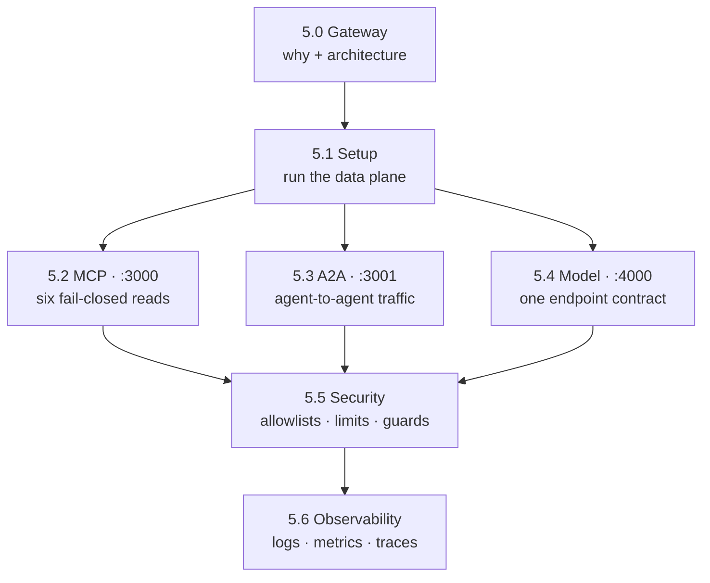

# 5. Gateway

!!! abstract "In one glance"

    - **You will:** Get the map of the chapter: which page governs which gateway port, and in what order to read them.
    - **You need:** Chapters 2-4 finished; [5.1. Gateway Setup](./5.1.%20Gateway%20Setup.md) installs the optional platform tier before starting anything.
    - **Time:** about 4 minutes, orientation.

## What will the gateway add?

Right now your agent dials its own backends. It calls an OpenAI-compatible model ([Chapter 2](../2. Agents/)), reads incidents over MCP ([Chapter 3](../3. Capabilities/)), and answers A2A clients directly.

Every one of those edges is wired straight into the process. That means a provider swap, a rate limit, or an audit requirement becomes an application change.

**[agentgateway](https://agentgateway.dev)** is a proxy that sits between your agent and its model, its tools, and its clients. It is a **data plane**: code on the request path that moves and inspects every call. Put it in the middle and each edge becomes a hop that can be routed, governed by policy, and observed, instead of a decision baked into code. It opens three ports:

| Port    | Who dials it | What crosses it                      |
| ------- | ------------ | ------------------------------------ |
| `:3000` | the agent    | MCP read tools                       |
| `:3001` | A2A clients  | agent-to-agent traffic               |
| `:4000` | the agent    | the OpenAI-compatible model endpoint |

The gateway owns connectivity and traffic policy; ADK keeps sessions, tool execution, and human confirmation ([Chapter 4](../4. Quality/)). The host profile stays account-free with Ollama/Qwen3.

??? note "Deeper: who builds agentgateway?"

    agentgateway was created by Solo.io and donated to the Linux Foundation; it is now an
    **[Agentic AI Foundation (AAIF)](https://aaif.io/projects/agentgateway/)** project. This
    chapter uses it as the connectivity and traffic-policy layer while keeping application approval and transactions in ADK/Python.

The full argument, the data-plane architecture, and the listener table are owned by [5.0. Gateway](./5.0. Gateway.md).

## Which page covers what?

Read the sections by their kind, not just their order. **5.0 is conceptual** — the case for the extra hop. The six pages after it are hands-on, and each ends with something you can see:

- **[5.0. Gateway](./5.0. Gateway.md)** _(concept)_: The connectivity and security problem agents face, and an agentgateway overview.
- **[5.1. Gateway Setup](./5.1. Gateway Setup.md)** _(hands-on)_: Start the whole stack on your laptop, through a wrapper that keeps every listener on loopback.
- **[5.2. MCP Gateway](./5.2. MCP Gateway.md)** _(hands-on)_: Watch the gateway allow exactly six read tools, refuse a seventh, and fail closed when the tool server is down.
- **[5.3. A2A Gateway](./5.3. A2A Gateway.md)** _(hands-on)_: Chat with the agent from a browser through the gateway, and approve a service restart.
- **[5.4. Model Gateway](./5.4. Model Gateway.md)** _(hands-on)_: Move the agent onto one model endpoint by changing a single variable, with local Qwen3 or GKE Vertex Gemini behind it.
- **[5.5. Gateway Security](./5.5. Gateway Security.md)** _(hands-on)_: Trip the prompt guard, review the allowlists and limits already active, then add tokens and TLS in an opt-in profile.
- **[5.6. Gateway Observability](./5.6. Gateway Observability.md)** _(hands-on)_: Read the gateway's own logs, metrics, and traces for a single request, and see what stays out of them.

## How does the chapter fit together?

Read [5.0. Gateway](./5.0. Gateway.md) for the why and the port table. Then stand the gateway up in [5.1. Gateway Setup](./5.1. Gateway Setup.md) and govern each of the three boundaries in turn.

Security ([5.5. Gateway Security](./5.5. Gateway Security.md)) and observability ([5.6. Gateway Observability](./5.6. Gateway Observability.md)) are cross-cutting rather than a fourth plane: their policies attach per-listener to MCP, A2A, and model traffic alike.



Before you start, three things about the shape of the chapter:

- **It all runs on your laptop.** The host profile needs no Kubernetes cluster, cloud account, or provider key.
- **It needs the platform tier, Docker, and Qwen3.** [5.1. Gateway Setup](./5.1.%20Gateway%20Setup.md) runs `mise run install:platform`, then the model and gateway doctors.
- **Not all of it is required.** The secured JWT/TLS profile in 5.5. Gateway Security is opt-in, the Vertex Gemini path in 5.4. Model Gateway is an optional proprietary comparison, and the Kubernetes material is a preview of Chapter 6.

## What proves this chapter worked?

One command stands the whole composition up and tears it down again:

```bash
mise run smoke:host
```

It runs the host stack against a fake model on temporary ports, so it proves the composition without spending model time.

The chapter checkpoint tests fail-closed MCP, A2A discovery, local model translation, prompt rejection, and telemetry through gateway ports only.

**You are done when:**

- You can say which of `:3000`, `:3001`, and `:4000` carries MCP tools, A2A clients, and model traffic.
- You can name the page that owns each of those three ports, and the two pages that cut across all three.
- You can state in one sentence what the gateway owns and what stays in ADK.

[Chapter 6](../6. Platform/) moves the same listener contract to **k3d**, a Kubernetes cluster that runs on your own machine, and to optional GKE overlays.

Continue to [5.0. Gateway](./5.0.%20Gateway.md) when the three ports and their owners are clear enough that you could redraw the map above from memory.
