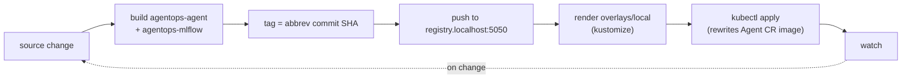
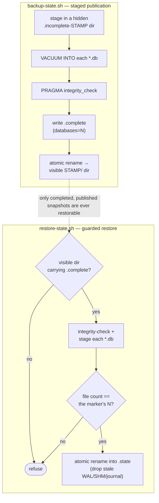

# 6.6. Platform Delivery

!!! abstract "In one glance"

    - **You will:** Deploy the whole stack with one command, reach the agent card through the gateway, then back its state up and restore it.
    - **You need:** [6.2. Platform Install](./6.2.%20Platform%20Install.md) finished (cluster and kagent installed) and Ollama able to bind the k3d bridge.
    - **Time:** about 60 minutes, hands-on.

## Which runtime profile should you run?

Pick the profile that matches your host before touching any manifest; the checkpoint accepts more than one:

| Your setup                                        | Profile to run                                                                |
| ------------------------------------------------- | ----------------------------------------------------------------------------- |
| Linux with Docker Engine                          | Local k3d — the required, validated path (`skaffold dev -p local`)            |
| macOS where the VM-to-Ollama bridge is not proven | Stay on the Chapter 5 host profile; it is an acceptable checkpoint            |
| GKE                                               | Plan-only (`tofu plan`) unless an approved deployment is explicitly requested |

Whichever you pick, never run the host Compose stack and the in-cluster stack together: both bind the same local forward ports, so the second one to start silently clashes with the first.

## How do you run the full local Kubernetes stack?

Two terminals and five commands, on the validated Linux/Docker Engine path. The first terminal binds Ollama to the k3d bridge:

```bash
export OLLAMA_HOST="$(docker network inspect k3d-local --format '{{(index .IPAM.Config 0).Gateway}}'):11434"
ollama serve
```

Use the same value in another terminal, pull Qwen3, and start the development loop:

```bash
export OLLAMA_HOST="$(docker network inspect k3d-local --format '{{(index .IPAM.Config 0).Gateway}}'):11434"
ollama pull qwen3:4b-instruct
mise run platform:dev
```

The explicit bridge bind is necessary: Ollama's default loopback listener is not reachable from k3d.

`mise run platform:dev` is the whole invocation as one task. It asserts that your kubectl context is `k3d-local`, changes into `infra/`, and runs `skaffold dev` on the `local` profile with the push target already set. By hand, from `infra/`, that is `SKAFFOLD_DEFAULT_REPO=registry.localhost:5050 skaffold dev -p local`. `skaffold run -p local` provides a non-watching deployment.

On macOS the container engine runs inside a VM, so the `docker network inspect` address above is not a valid bind address there. Stay on the Chapter 5 host profile unless you deliberately re-bind Ollama.

??? note "Deeper: re-binding Ollama on macOS (Docker Desktop or Colima)"

    On macOS, Docker Desktop and Colima put the container engine inside a VM, so the Linux `docker network inspect` address is not a macOS bind address. [k3d injects `host.k3d.internal`](https://k3d.io/stable/usage/k3s/) for pod-to-host access, but Ollama binds loopback by default. Keep using the Chapter 5 host path unless you deliberately apply [Ollama's macOS bind configuration](https://docs.ollama.com/faq#how-do-i-configure-ollama-server) and expose the app to the VM:

    ```bash
    launchctl setenv OLLAMA_HOST "0.0.0.0:11434"
    # Quit and reopen Ollama.app, then verify from a short-lived pod in the
    # default namespace (the restricted agentops namespace rejects a bare pod):
    kubectl run ollama-check --rm -i --restart=Never \
      --image=docker.io/busybox:1.37.0 -- \
      wget -qO- http://host.k3d.internal:11434/api/tags
    ```

    That bind may expose unauthenticated Ollama to the local network; use a trusted/firewalled network and remove the setting after the lab with `launchctl unsetenv OLLAMA_HOST`, then restart the app. The repository does not claim this VM bridge is validated across every Docker Desktop/Colima release.

Do **not** start the host Compose observability stack at the same time; the Kubernetes overlay already deploys MLflow and OTel and uses the same local forward ports.

## What does Skaffold deploy?

Two images and one overlay, rebuilt and re-applied every time you save a file. Each pass does five things:

1. Builds `agentops-agent` from `agents/` and `agentops-mlflow` from `infra/mlflow`.
1. Tags them with the abbreviated Git commit.
1. Pushes to `SKAFFOLD_DEFAULT_REPO`.
1. Renders the chosen Kustomize overlay — the per-environment patch set, `local` or `gke`.
1. Applies it with kubectl.

`skaffold dev` then watches your sources and repeats the loop on every change:



`skaffold run -p local` is the same pipeline without the watch step — one build-and-deploy pass, useful for CI-shaped or one-shot deploys.

Verify:

```bash
kubectl -n agentops get pods,pvc,svc
kubectl -n agentops wait --for=condition=Ready pod --all --timeout=180s
kubectl -n agentops port-forward svc/agentgateway 3001:3001
curl -fsS http://localhost:3001/.well-known/agent-card.json | jq .name
```

Expected name: `AgentOps Agent`. If you get something else, the cause is almost always one of three wiring mistakes:

| If you see this                                                 | Check this                                                                                               |
| --------------------------------------------------------------- | -------------------------------------------------------------------------------------------------------- |
| Pods never turn Ready and events say the image cannot be pulled | The build never reached `registry.localhost:5050`; `mise run platform:dev` sets that push target for you |
| The agent answers nothing, or its turns fail                    | Ollama is still bound to loopback instead of the k3d bridge address exported above                       |
| The port-forward returns nothing                                | The host Compose stack is still running and holding the same local ports                                 |

## What state would you lose if the PVC died?

Everything the platform writes at runtime lives on one **PersistentVolumeClaim (PVC)**: a disk the cluster keeps and re-attaches to a replacement pod.

That volume is `agentops-agent-state`, mounted at `/app/state` (host equivalent: `agents/python/.state/`):

1. `runtime.db` — ADK sessions and A2A tasks from the persistent server (Ch. 2.4).
1. `incidents.db` — the writable dataset copy, including approved `restart_service`/`resolve_incident` mutations and the append-only `audit_log` (Ch. 3.1).

The seed dataset is safe in Git and in the image, so losing the volume loses no course data — it loses the evidence: every session and every audit row justifying an approved action. Without a backup, one PVC failure (or a hasty `skaffold delete`) erases that trail silently.

## How do you back up SQLite state safely?

Never `cp` a live SQLite file: a copy taken mid-transaction can be torn. Safe hot copies go through SQLite itself, which holds the page-level locks for you.

Both the backup and the restore enforce one shared contract. A snapshot only becomes restorable once it is complete and published, so an interrupted attempt can never masquerade as the newest good one:



On the host, `mise run state:backup` runs [backup-state.sh](https://github.com/MLOps-Courses/agentops-open-course/blob/main/infra/scripts/backup-state.sh). It snapshots every state database with `VACUUM INTO` — SQLite's own command for writing a consistent copy of a live database — and verifies each copy with `PRAGMA integrity_check`. It builds under a hidden temporary directory, writes `.complete` only after every database passes, then atomically renames the directory into the visible timestamp namespace. Retention considers only those completed snapshots and keeps the newest seven under the gitignored `.state-backups/`:

```bash
mise run state:backup
```

In Kubernetes, a **CronJob** — a workload the cluster runs on a schedule — does the same thing unattended. The `agentops-state-backup` CronJob in [state-backup.yaml](https://github.com/MLOps-Courses/agentops-open-course/blob/main/infra/k8s/base/state-backup.yaml) applies the same staged-publication contract nightly with the Python stdlib backup API. It reuses the course image, so no new tool or image pin enters the supply chain, and writes completed timestamped snapshots from the `agentops-agent-state` PVC into a second `agentops-state-backups` PVC:

```python
with target:
    source.backup(target)
```

Be honest about the scope: this is single-node, lab-grade backup, not disaster recovery. The backup PVC sits in the same cluster on the same disk, there is no point-in-time recovery between nightly snapshots, and `skaffold delete` removes both PVCs together. Production would ship snapshots off-cluster to object storage and restore them on separate infrastructure.

## How do you run a restore drill?

A backup you have never restored is a hope, not a backup. `mise run state:drill` runs [backup-drill.sh](https://github.com/MLOps-Courses/agentops-open-course/blob/main/infra/scripts/backup-drill.sh), which makes that proof repeatable and offline. It runs against a throwaway temporary directory, never your real `agents/python/.state`, and needs no cluster or model:

```bash
mise run state:drill
```

The drill seeds throwaway state and approves a mock action: the same `UPDATE` plus `audit_log` append the agent commits in one transaction. It then proves five things.

1. A failed attempt publishes nothing — it first adds a corrupt database.
1. A same-timestamp lock rejects a concurrent host backup.
1. Neither a corrupt database nor a completed marker with a missing database can partially replace existing state.
1. Retention ignores, and restore rejects, hidden or unmarked directories.
1. Valid state survives: it snapshots, deletes the state directory, restores it with [restore-state.sh](https://github.com/MLOps-Courses/agentops-open-course/blob/main/infra/scripts/restore-state.sh), and asserts the row counts and the last audit entry survived.

Expected final line: `drill passed: 1 audit row(s) and 1 session row(s) survived backup + restore`.

To restore real host state, stop every writer first (the A2A server, the MCP server, any `adk run`/`adk web`), select only a visible directory carrying `.complete`, then point the script at it. The script rejects hidden/unpublished or unmarked snapshots, requires the marker's database count to match the files present, verifies database integrity, and prints the restored `audit_log` row count:

```bash
snapshot=""
for candidate in .state-backups/*; do
  [[ -f "${candidate}/.complete" ]] && snapshot="${candidate}"
done
test -n "${snapshot}"
mise run state:restore -- "${snapshot}"
```

On k3d, first prove the CronJob produces a valid snapshot on demand:

```bash
kubectl -n agentops create job --from=cronjob/agentops-state-backup state-backup-drill
kubectl -n agentops wait --for=condition=complete job/state-backup-drill --timeout=180s
kubectl -n agentops logs job/state-backup-drill
kubectl -n agentops delete job state-backup-drill
```

Then run the in-cluster restore with the writers stopped, exactly like on the host. Pause the Skaffold loop, delete the BYO agent (kagent removes its deployment; Skaffold re-applies the resource later), and scale the MCP server to zero:

```bash
# Record this value before the drill; run the same command after redeploying.
kubectl -n agentops exec deploy/agentops-mcp -- \
  python -c 'import sqlite3; c=sqlite3.connect("file:/app/state/incidents.db?mode=ro", uri=True); print(c.execute("SELECT count(*) FROM audit_log").fetchone()[0])'

kubectl -n agentops delete agents.kagent.dev agentops-agent
kubectl -n agentops scale deploy agentops-mcp --replicas=0
```

Restore the newest completed snapshot with a short-lived Job that mounts both PVCs and reuses the course image. The Job copies every database into a hidden staging directory, verifies every staged copy, and only then replaces the stopped state. The backup claim is read-only; only the state claim is writable.

First capture the image the Job should reuse:

```bash
image="$(kubectl -n agentops get deploy agentops-mcp -o jsonpath='{.spec.template.spec.containers[0].image}')"
```

Then apply the Job. Run it as it is written: you do not need to read every line to use it.

??? note "Deeper: the restore Job manifest"

    ```bash
    kubectl -n agentops apply -f - <<YAML
    apiVersion: batch/v1
    kind: Job
    metadata:
      name: state-restore-drill
      namespace: agentops
    spec:
      template:
        spec:
          automountServiceAccountToken: false
          restartPolicy: Never
          securityContext:
            runAsNonRoot: true
            runAsUser: 10001
            runAsGroup: 10001
            fsGroup: 10001
            seccompProfile: { type: RuntimeDefault }
          containers:
            - name: restore
              image: ${image}
              command: ["python", "-c"]
              args:
                - |
                  import pathlib, shutil, sqlite3, tempfile
                  state = pathlib.Path("/app/state")
                  completed = sorted(
                      p
                      for p in pathlib.Path("/backups").iterdir()
                      if p.is_dir() and not p.name.startswith(".") and (p / ".complete").is_file()
                  )
                  if not completed:
                      raise SystemExit("no completed snapshots under /backups")
                  snapshot = completed[-1]
                  databases = sorted(snapshot.glob("*.db"))
                  counts = [
                      line.removeprefix("databases=")
                      for line in (snapshot / ".complete").read_text(encoding="utf-8").splitlines()
                      if line.startswith("databases=")
                  ]
                  if len(counts) != 1 or not counts[0].isdecimal() or int(counts[0]) < 1:
                      raise SystemExit(f"invalid databases count in {snapshot / '.complete'}")
                  expected = int(counts[0])
                  if len(databases) != expected:
                      raise SystemExit(f"{snapshot} declares {expected} database(s), found {len(databases)}")
                  staging = pathlib.Path(tempfile.mkdtemp(dir=state, prefix=".restore."))
                  try:
                      for database in databases:
                          shutil.copy2(database, staging / database.name)
                      for database in sorted(staging.glob("*.db")):
                          source = sqlite3.connect(f"file:{database}?mode=ro", uri=True)
                          try:
                              status = source.execute("PRAGMA integrity_check").fetchone()[0]
                          finally:
                              source.close()
                          if status != "ok":
                              raise SystemExit(f"integrity check failed for {database.name}: {status}")
                      for database in sorted(staging.glob("*.db")):
                          for suffix in ("-wal", "-shm", "-journal"):
                              (state / (database.name + suffix)).unlink(missing_ok=True)
                          database.replace(state / database.name)
                          print("restored", database.name, "from", snapshot.name)
                  finally:
                      shutil.rmtree(staging, ignore_errors=True)
              securityContext:
                allowPrivilegeEscalation: false
                readOnlyRootFilesystem: true
                capabilities: { drop: [ALL] }
              volumeMounts:
                - { name: state, mountPath: /app/state }
                - { name: backups, mountPath: /backups, readOnly: true }
          volumes:
            - { name: state, persistentVolumeClaim: { claimName: agentops-agent-state } }
            - { name: backups, persistentVolumeClaim: { claimName: agentops-state-backups } }
    YAML
    ```

Finally wait for the Job, read its log, and delete it:

```bash
kubectl -n agentops wait --for=condition=complete job/state-restore-drill --timeout=180s
kubectl -n agentops logs job/state-restore-drill
kubectl -n agentops delete job state-restore-drill
```

Then redeploy, wait for the read service, and run the same direct count used before the drill:

```bash
skaffold run -p local
kubectl -n agentops rollout status deploy/agentops-mcp --timeout=180s
kubectl -n agentops exec deploy/agentops-mcp -- \
  python -c 'import sqlite3; c=sqlite3.connect("file:/app/state/incidents.db?mode=ro", uri=True); print(c.execute("SELECT count(*) FROM audit_log").fetchone()[0])'
```

The value must match the pre-drill count. The stopped-writer requirement is the whole reason to practice this before an incident, not during one.

## How do you tear down without losing data by accident?

`skaffold delete` removes the course workloads, including their PVCs and data, without deleting the shared cluster or its kagent control plane:

```bash
# Choose exactly one profile after reviewing the context.
skaffold delete -p local
# skaffold delete -p gke
```

On a dedicated lab only, verify that no other namespaces use kagent before removing the cluster-wide controller. Delete the `local` cluster only after confirming no other project uses it:

```bash
helmfile destroy
k3d cluster delete local
```

For GCP, inspect `tofu plan -destroy` and require separate confirmation before `tofu destroy`. GCS `force_destroy=false` protects a non-empty artifact bucket from silent deletion.

!!! info "Optional from here: the GKE lab creates nothing"

    The four sections below plan a Google Kubernetes Engine deployment and stop at `tofu plan`. The course checkpoint is the local profile only, so you can skip them and lose nothing.

## What would the optional GKE lab create?

Nothing is created on this page. This is what the module would build if an approved apply ever ran.

**OpenTofu** is the open-source fork of Terraform. The module under `infra/gcp/` defaults to project `agentops-open-course` and creates:

- Required GCP APIs, VPC-native subnet/ranges, and a zonal GKE Standard cluster.
- One Spot `e2-standard-2` node with a 30 GiB standard disk.
- Artifact Registry cleanup for tagged or untagged image versions older than 30 days, while preserving the five most recent versions.
- A private-access-prevented GCS bucket for MLflow artifacts.
- Separate node, agentgateway, and MLflow Google service accounts plus narrow IAM/WIF bindings.

Three words in that list are GCP vocabulary:

- **zonal**: the cluster's control plane lives in one zone.
- **VPC-native**: pods take their IP addresses from the network's own ranges.
- **Spot**: discounted capacity Google can reclaim at any time.

It creates no Cloud NAT, Ingress, or public LoadBalancer. Nodes have public IPs to avoid NAT cost; workloads remain private ClusterIP services.

## How do you plan without deploying?

A plan prints what an apply would create and changes nothing in the cloud.

From `infra/gcp/`, authenticate Application Default Credentials, create a gitignored `terraform.tfvars` from the example, and restrict the control plane to your public `/32`. Then:

```bash
tofu init
tofu validate
tofu plan -out=tfplan
```

Review every created/changed/destroyed resource and current prices. Planning is not permission to apply. This course task does not execute cloud commands.

## How would an approved GKE deployment proceed?

Only after explicit approval:

```bash
tofu apply tfplan
tofu output -raw get_credentials_command
```

Run the printed `gcloud container clusters get-credentials ...` command, then return to `infra/`:

```bash
kubectl apply -f k8s/base/namespace.yaml
helmfile apply
SKAFFOLD_DEFAULT_REPO="$(cd gcp && tofu output -raw artifact_registry_repository)" \
  skaffold run -p gke
```

If you override the default project/bucket, update the declarative GKE overlay annotations/artifact destination and gateway `projectId` as documented in `infra/gcp/README.md` before applying.

## Will the GKE lab stay under USD 20 per month?

That is a design target, not a guarantee.

??? note "Deeper: what the USD 20 target assumes"

    It assumes the billing account's monthly GKE free-tier credit covers one zonal cluster management fee, Spot capacity remains available/cheap, traffic is light, and resources are destroyed promptly. Compute, disks/PVCs, Artifact Registry, GCS, network, and Vertex usage remain billable. Without the credit, the cluster management fee is USD 0.10 per hour. Check current [GKE pricing](https://cloud.google.com/kubernetes-engine/pricing) and the plan.

!!! success "Key takeaways"

    - One `mise run platform:dev` builds, pushes, and deploys the whole stack.
    - The rest of this page is the backup and restore drill you must rehearse before an incident, not during one.

## What proves this page worked?

For this course run, complete the local profile only: pods ready, PVCs bound, A2A card through gateway `:3001`, MCP/model routes healthy, and MLflow reachable by port-forward. On macOS, the Chapter 5 host profile is an acceptable checkpoint when the VM-to-Ollama bridge is not proven. Leave GCP at a reviewed plan; do not deploy it yet.

**You are done when:**

- `kubectl -n agentops get pods,pvc,svc` shows every pod Ready and the PVCs Bound.
- `curl -fsS http://localhost:3001/.well-known/agent-card.json | jq .name` prints `AgentOps Agent` through the port-forward.
- `mise run state:drill` ends with `drill passed: 1 audit row(s) and 1 session row(s) survived backup + restore`.
- The in-cluster restore printed the same `audit_log` count you recorded before the drill.
- Nothing exists in GCP: you reviewed a `tofu plan` and ran no `tofu apply`.

Continue to [6.7. Progressive Delivery](./6.7.%20Progressive%20Delivery.md) when the local stack answers through the gateway and you have restored its state from a backup at least once.
