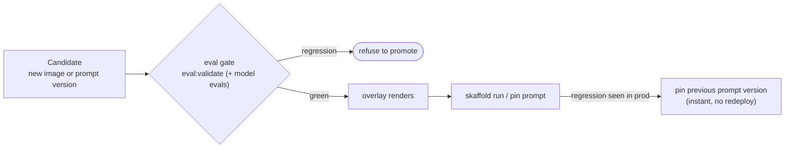

# 6.7. Progressive Delivery

!!! abstract "In one glance"

    - **You will:** Gate a rollout on the evaluation suite and prove that a failing eval blocks the promotion.
    - **You need:** Chapter 4.4. Evaluations done and `cd agents/python && mise run eval:validate` passing; no cluster required.
    - **Time:** about 20 minutes, hands-on.

## Why gate a rollout on evaluation?

[6.6. Platform Delivery](./6.6.%20Platform%20Delivery.md) ships a change with one `skaffold run`: build the image, apply the overlay, done. That is fine for infrastructure whose correctness a container probe can confirm.

It is not fine for an agent. A readiness probe cannot see the thing most likely to regress: whether the agent still calls the right tools, stays grounded, and costs the same. A new prompt version or model can be perfectly healthy and quietly worse.

The fix is not a fancier deployment; it is a **gate**. Promotion should be conditional on the same evaluations [4.4. Evaluations](../4.%20Quality/4.4.%20Evaluations.md) already defines, run against the candidate before it takes traffic. `mise run promote` makes that conditionality a command instead of a discipline you have to remember:



## What does `mise run promote` actually gate?

Three steps, from [`promote.sh`](https://github.com/MLOps-Courses/agentops-open-course/blob/main/scripts/promote.sh), in strict order — a failure at any step refuses the promotion:

1. **The deterministic offline gate always runs.** `mise run eval:validate` checks the eval set is consistent against the seed with no model needed. This is the same gate CI runs, re-asserted at the promotion boundary.
1. **Model-backed evidence is opt-in.** With `--with-model`, it also runs `eval:mlflow` (trajectory + response scorers) and `eval:ground` (groundedness) against the candidate. A wrong-trajectory or newly-hallucinated regression then blocks promotion, not just a structural one. Skipped by default so the gate stays runnable without a model or cluster.
1. **The target overlay must render.** `kustomize build` of the overlay proves the manifests are valid before anyone applies them, the same render `mise run check:infra` validates.

Only after all three pass does it print the exact `skaffold run` promote command and the instant prompt-rollback lever. It applies nothing itself — the gate is the value; the apply stays an explicit human step.

```bash
mise run promote                 # gate the local overlay, offline
mise run promote -- --with-model # include the model-backed evals
mise run promote -- gke          # gate the gke overlay
```

No cluster is needed, but the pinned toolchain must be installed (`mise install`), because step 3 renders the overlay with `kustomize`. The offline gate itself runs in seconds.

## Which surface should you promote progressively, and which reverses instantly?

Move the **prompt version** first. It is the one surface you can both canary and reverse without a redeploy.

To **canary** a change is to let a new version serve a slice of real work while the old one keeps serving, so you can compare before committing.

The instruction lives in the MLflow prompt registry ([4.4. Evaluations](../4.%20Quality/4.4.%20Evaluations.md#how-do-you-version-pin-and-roll-back-the-instruction)). A new version is promoted by pinning `AGENT_PROMPT_URI=prompts:/agentops-agent-instruction/N`, compared against the current one with `mise run eval:ab`, and rolled back in seconds by pinning `N-1`.

A new **image** is the heavier surface. It promotes through `skaffold run` behind the same gate, and rolls back by redeploying the previous immutable digest.

Concretely, the shipped prompt-canary flow is four steps on a host process, no cluster required. Run all four from `agents/python/`, where those eval tasks are defined:

1. Register the edited instruction: `mise run eval:mlflow` content-addresses the new `INSTRUCTION` as `agentops-agent-instruction` version `N` in the prompt registry.
1. Canary it on a host process by pinning `AGENT_PROMPT_URI=prompts:/agentops-agent-instruction/N`, so that process's traces and evaluations are attributable to exactly version `N`.
1. Compare `N` against `N-1` with `mise run eval:ab`, reading the deterministic scorer deltas rather than prose.
1. Keep it or reverse instantly: leave `N` pinned to promote, or re-pin `N-1` to roll back in seconds — no rebuild, no redeploy.

The rule that generalizes: gate every promotion on evaluation, and reach first for the surface whose rollback is a config change, not a rebuild.

The same prompt-pin lever is what [7.7. Incident Response](../7.%20Observability/7.7.%20Incident%20Response.md#what-can-you-change-to-mitigate-without-a-redeploy) reaches for during an incident; rolling back to a previous image digest is owned by [7.0. Reproducibility](../7.%20Observability/7.0.%20Reproducibility.md).

## What does this lab deliberately not do?

This lab does not ship an automated, traffic-splitting canary with SLO-driven rollback. It says so rather than implying otherwise. Two honest reasons:

1. **There is one replica to split.** The agent runs as a single kagent-managed workload on a single-node cluster ([6.0. Platform](./6.0.%20Platform.md)); a canary needs a second instance and a router that weights traffic between them. That is real infrastructure, not a manifest tweak.
1. **Automated rollback needs a live quality signal.** Rolling back on a metric requires an **online scorer**: something that samples live traffic and grades it after release. The course deliberately does not run one ([7.5. Online Evaluation](../7.%20Observability/7.5.%20Online%20Evaluation.md)), so any rollback here is a human reading evidence and pinning a version, not an automated controller.

??? note "Deeper: what a production progressive rollout would add"

    A production progressive rollout would add exactly those pieces: a second agent instance (a canary kagent Agent), agentgateway route **weights** shifting traffic from stable to canary in steps, and an automated rollback keyed to the burn-rate SLO and online scores. The eval gate in this chapter is the precondition every one of those steps still depends on — you canary a candidate you have already evaluated, never one you have not.

## What proves this page worked?

Prove the gate blocks a regression, with no cluster required:

1. Run `mise run promote` and confirm it passes the offline gate, renders the `local` overlay, and prints the promote and rollback commands.
1. Induce a regression: temporarily add a case to `agents/python/evals/ops.evalset.json` that references an incident id absent from the seed. Run `mise run promote` again and confirm `eval:validate` fails and the promotion is refused before any render or apply.
1. Revert the eval set and confirm `mise run promote` passes again.

!!! warning "Pick an id the seed does not deliberately exclude"

    `INC-999` and `warehouse` will **not** break the gate. They are the negative cases the eval set is built on, so `tests/test_evalset.py` expects them to be missing ([4.4. Evaluations](../4.%20Quality/4.4.%20Evaluations.md#why-do-negative-and-adversarial-cases-belong-in-the-eval-set)). Use any other absent id, such as `INC-042`.

For step 2, paste this entry into the `eval_cases` array of `agents/python/evals/ops.evalset.json`. It asks for `INC-042`, which the seed does not contain:

```json
{
  "eval_id": "regression-drill",
  "conversation": [
    {
      "invocation_id": "inv-regression-drill",
      "user_content": { "role": "user", "parts": [{ "text": "Give me the details of incident INC-042." }] },
      "final_response": { "role": "model", "parts": [{ "text": "INC-042 does not exist." }] },
      "intermediate_data": {
        "tool_uses": [{ "name": "get_incident", "args": { "incident_id": "INC-042" } }],
        "intermediate_responses": []
      },
      "creation_timestamp": 0.0
    }
  ],
  "session_input": { "app_name": "agentops_agent", "user_id": "eval", "state": {} },
  "creation_timestamp": 0.0
}
```

`mise run promote` then stops at step 1 and names the offending case:

```text
E               AssertionError: ('regression-drill', 'INC-042')
FAILED tests/test_evalset.py::test_referenced_entities_exist_in_the_seed_data
[eval:validate] ERROR task failed
```

Delete the entry again and `mise run promote` reaches `The local overlay renders cleanly.` at step 3.

You have completed the loop when a change that fails evaluation cannot reach the promote command — which is what makes evaluation a gate rather than a report.

**You are done when:**

- `mise run promote` prints `[1/3]`, `[2/3]`, `[3/3]`, then the `skaffold run` promote command and the `AGENT_PROMPT_URI` rollback line.
- With the broken case in place, the run stops inside `[1/3]` and never prints the promote command.
- The eval set is back to its committed state and `mise run promote` passes again.
- You can name the surface you would move first for a wording change, and the one you would move for a code change.

Continue to [Observability](../7.%20Observability/index.md) when a failing eval visibly refuses the promotion on your own machine.
