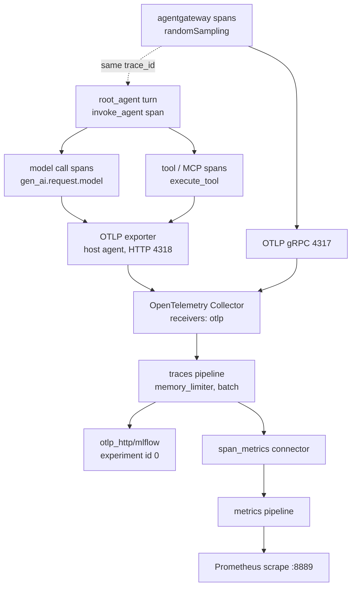

# 7.1. Tracing

!!! abstract "In one glance"

    - **You will:** Send one request and read its trace in MLflow as a tree of model, tool, and gateway spans.
    - **You need:** Docker running, `mise run observability:up` serving MLflow on `http://localhost:5000`, and Ollama serving `qwen3:4b-instruct`.
    - **Time:** about 35 minutes, hands-on.

## Why trace an agent instead of logging the final answer?

One turn took far longer than it should have. Was it the model, a tool, or the gateway? A log line of the final answer cannot say.

A log line records that something happened; a trace records _how the work was structured in time_. Depending on the entrypoint, one request can cross:

- the A2A and model listeners in agentgateway
- workflow stages or in-process specialist transfers
- several model calls
- MCP discovery and invocation
- tool code
- runbook retrieval
- human confirmation
- session storage

Each is a separate process or library call with its own latency and failure surface. A flat log of the final answer tells you it was slow or wrong. It cannot tell you _which_ boundary burned the latency budget or returned the error, because it throws away the parent/child and start/end relationships that make that attributable.

Distributed tracing keeps exactly that structure. Every unit of work becomes a **span** with a start time, an end time, a status, and a parent, and every span in one request shares one **trace id**. The result is a tree you can read top-down: the turn, the model calls under it, the tool calls under those, the MCP round trip under a tool. When something is slow you open the widest bar; when something fails you open the span whose status flipped to `ERROR`.

That is why observability for agents starts with traces and treats logs and metrics as derived views. Those two pillars are owned by [7.2. Monitoring](./7.2.%20Monitoring.md); this page owns the trace.

## How do you open the trace UI?

Start the stack first, so the rest of this page has something to point at.

For host mode, bring up the observability stack:

```bash
mise run observability:up
```

Open `http://localhost:5000`, select the `agentops-agent` experiment, and inspect a trace after one agent request. For Kubernetes, forward the ClusterIP service:

```bash
kubectl -n agentops port-forward svc/mlflow 5000:5000
```

Do not run both stacks on the same host ports.

The rest of this page explains what lands in that UI, starting with the smallest piece.

## What is inside one span?

A span is a timed, attributed node. ADK emits them through `google.adk.telemetry`, and each carries a stable set of fields:

1. **Identity and structure**: a `trace_id` shared by the whole request, a `span_id`, and a parent span id — the edges that build the tree. That same `trace_id` is what later joins a span to its log lines in Loki (see [7.2. Monitoring](7.2.%20Monitoring.md#how-do-i-jump-from-a-trace-to-its-logs)).
1. **Timing and status**: start and end timestamps (so duration is `end - start`), and a status that is `OK` or `ERROR`.
1. **Semantic attributes** following the OpenTelemetry GenAI conventions. The agent-invocation span sets `gen_ai.operation.name` to `invoke_agent`; each model call sets `gen_ai.request.model` and token-usage attributes; each tool call sets `gen_ai.operation.name` to `execute_tool` plus `gen_ai.tool.name`; and any failure sets `error.type`.

Those three attributes — `gen_ai.operation.name`, `gen_ai.request.model`, and `error.type` — are not incidental. They are exactly the bounded dimensions the collector later slices metrics by ([`otel-collector.yaml`](https://github.com/MLOps-Courses/agentops-open-course/blob/main/infra/observability/otel-collector.yaml)). They are chosen because they are non-sensitive and low-cardinality: each has a small set of possible values.

What a span does **not** carry by default is the prompt or the model response body. That is a deliberate privacy choice, covered by the message-capture section below.

The optional orchestration paths make trace shape part of the lesson. `mise run workflow` always crosses four model-backed stages, so its trace should expose `plan`, `investigate`, `evidence_review`, and `recommend` rather than one opaque “workflow” bar. `mise run coordinator` adds a specialist's agent span and the `transfer_to_agent` tool event only when its model delegates. That difference lets you attribute the latency cost of explicit review or specialist routing instead of guessing from the final answer.

The default agent's post-action rule is visible the same way. After an approved write, a complete trajectory should show fresh incident and service reads before `save_incident_note`. The write span and audit row prove the command ran; the later reads prove whether recovery happened. If they are absent, the trace exposes instruction non-compliance rather than letting an action response masquerade as success.

## How is ADK telemetry enabled?

Nothing on this page asks you to switch tracing on. The default agent, structured report, bounded workflow, and coordinator modules each call `setup_telemetry()` at import. Their ADK discovery paths, `adk web`, model-backed evals, and the standalone A2A server therefore share one setup path.

That is deliberate: instrumentation you have to remember to turn on is instrumentation that will be off in production.

```python
def setup_telemetry() -> None:
    """Enable OTLP tracing/metrics/logs from ``OTEL_EXPORTER_OTLP_ENDPOINT`` (and friends).

    Call this once at process start for programmatic runs or ``adk run``. With no endpoint,
    nothing is exported.
    """
    # Content capture is opt-in: traces retain timing, model, tool, token, and
    # status metadata without duplicating user prompts or model responses.
    os.environ.setdefault("ADK_CAPTURE_MESSAGE_CONTENT_IN_SPANS", "false")
    os.environ.setdefault("OTEL_INSTRUMENTATION_GENAI_CAPTURE_MESSAGE_CONTENT", "false")
    maybe_set_otel_providers()
    if _otel_logging_configured():
        _install_agent_log_handler()
```

See [`telemetry.py`](https://github.com/MLOps-Courses/agentops-open-course/blob/main/agents/python/src/agent/telemetry.py). Three things happen here:

1. Two `setdefault` calls fix content capture to `false`. Traces keep timing, model, tool, token, and status metadata but do not duplicate user prompts or model responses — the privacy default the message-capture section below relies on.
1. `maybe_set_otel_providers()` lets ADK install the standard OTLP trace, metric, and log providers from the ambient `OTEL_*` environment.
1. A single deduplicated OTel logging bridge is installed on the `agent` logger **only** when a logs or combined OTLP endpoint exists. That log path belongs to [7.2. Monitoring](./7.2.%20Monitoring.md), not this page.

The important corollary is the no-op path. With no endpoint set or `OTEL_SDK_DISABLED=true`, `setup_telemetry()` exports nothing at all, so importing the agent in a unit test never tries to reach a collector.

A trace-only configuration is different. With only `OTEL_EXPORTER_OTLP_TRACES_ENDPOINT` set, `maybe_set_otel_providers()` still installs a span exporter and exports traces; only `_otel_logging_configured()` returns `False`, so the sole thing skipped is the log bridge.

Two low-friction ways to verify tracing without the MLflow UI:

- Run the agent under `adk web`, which exposes its own built-in trace view.
- Flip `OTEL_SDK_DISABLED=true` and confirm the process still runs and simply stops emitting.

## How do you point a host agent at the collector?

The agent is a plain OTLP client; you point it at the collector with standard environment variables:

```bash
OTEL_EXPORTER_OTLP_ENDPOINT=http://localhost:4318
OTEL_EXPORTER_OTLP_PROTOCOL=http/protobuf
OTEL_SERVICE_NAME=agentops-agent
```

Kubernetes supplies `http://otel-collector:4318` and resource attributes for namespace and environment instead. The collector accepts both OTLP protocols on two ports:

```yaml
receivers:
  otlp:
    protocols:
      grpc:
        endpoint: 0.0.0.0:4317
      http:
        endpoint: 0.0.0.0:4318
```

The host agent above uses `http/protobuf`, so it talks to **4318**. agentgateway is a separate emitter written in Rust and speaks OTLP **gRPC**, so it targets **4317** — same collector, different receiver port. There is no functional difference in the spans; the split is purely which client library each side ships. Getting the port wrong is the most common "no traces" cause: an `http/protobuf` client pointed at 4317 silently fails to connect.

| Emitter      | OTLP protocol   | Collector port |
| ------------ | --------------- | -------------- |
| Host agent   | `http/protobuf` | `4318`         |
| agentgateway | gRPC            | `4317`         |

Both reach the one collector; only the receiver port differs.

## How do the gateway and agent spans end up in one trace?

A request through the platform crosses at least two processes, agentgateway and the agent, and each emits its own spans. They still land in **one** trace.

What joins them is **trace context propagation**: carrying one request's trace identity across a process boundary. The gateway starts (or continues) a trace and injects the `trace_id` and current `span_id` into the outbound request. The agent's SDK extracts them and makes its own spans children of the gateway's. Both sides then export to the same collector, which writes them into the same MLflow experiment.

So you read the gateway hop and the agent's model and tool spans as one tree, instead of two disconnected timelines you have to correlate by timestamp. This is the real payoff of tracing over logging.

In Kubernetes the two sides even share telemetry infrastructure beyond traces: the in-cluster collector additionally scrapes agentgateway's Prometheus endpoint for its metrics ([`otel-collector-config.yaml`](https://github.com/MLOps-Courses/agentops-open-course/blob/main/infra/k8s/base/otel-collector-config.yaml)), so one collector is the join point for both pillars.

The practical test is simple. Send a request _through_ the gateway, open the trace in MLflow, and confirm a gateway span sits above the agent's `invoke_agent` span in the same trace rather than in a separate one.

## Is any trace sampled before it reaches the collector?

Sampling decides which traces are kept; the two emitters here decide differently, and it is worth knowing which. The host agent sets no `OTEL_TRACES_SAMPLER`, so the SDK default applies and it records every span it starts — on lab traffic that is fine and makes debugging deterministic. agentgateway sets `randomSampling: true` in its tracing config ([`k3d/config.yaml`](https://github.com/MLOps-Courses/agentops-open-course/blob/main/infra/agentgateway/k3d/config.yaml)):

```yaml
tracing:
  otlpEndpoint: http://otel-collector.agentops.svc.cluster.local:4317
  randomSampling: true
```

So the gateway may drop a fraction of its own spans under load while the agent still emits all of its. Do not read a missing gateway span as a bug when the agent tree is complete; read it as gateway sampling.

??? note "Deeper: the second place spans get dropped"

    The second place traces can be shed is the collector itself: the traces pipeline runs a `memory_limiter` (400 MiB soft cap, 100 MiB spike) ahead of a `batch` processor, so under memory pressure the limiter applies backpressure and can refuse batches rather than let the collector OOM. That is a deliberate stability trade — dropped telemetry over a dead collector — and it is why `ObservabilityCollectorDown` is a paging alert in 7.2.

## What does the collector do?

The collector is the one vendor-neutral choke point every emitter funnels into. Its traces pipeline is three steps and a fan-out:

```yaml
traces:
  receivers: [otlp]
  processors: [memory_limiter, batch]
  exporters: [otlp_http/mlflow, span_metrics]
```

Read those three keys as three roles: a **receiver** takes telemetry in, a **processor** shapes it in flight, and an **exporter** sends it on. The traces pipeline receives OTLP (from both ports), bounds memory and batches spans, then sends each span to **two** places at once:

1. The `otlp_http/mlflow` exporter, which stores the full trace tree in MLflow.
1. The `span_metrics` **connector** — a pipeline element that feeds another pipeline instead of exiting the collector. It turns spans into request-count and duration metrics and re-injects them into the metrics pipeline, sliced by the three bounded dimensions above and exported to Prometheus on `:8889`.

So the same spans become both a browsable trace and RED metrics: Rate (requests per second), Errors (failed request ratio), and Duration (latency distribution), without the app emitting metrics itself. This page stops at "spans become metrics here"; the metrics side is owned by [7.2. Monitoring](./7.2.%20Monitoring.md).



That is why the experiment you opened in MLflow is already called `agentops-agent`: the MLflow image idempotently names built-in experiment id `0` as `agentops-agent` on startup ([`entrypoint.py`](https://github.com/MLOps-Courses/agentops-open-course/blob/main/infra/mlflow/entrypoint.py)).

The collector's exporter targets id `0` with the `x-mlflow-experiment-id: "0"` header, while evaluation code selects `MLFLOW_EXPERIMENT_NAME=agentops-agent`. Both paths therefore land in the same experiment on a fresh or reused volume, so live traces and offline eval runs share one lineage. [7.0. Reproducibility](./7.0.%20Reproducibility.md) links model and prompt evidence into that same store.

## Why does the application never import an MLflow tracing SDK?

Because swapping the trace store is a platform decision, and the code should not have to move for it. The agent imports only OpenTelemetry; the one place that names MLflow is the collector exporter you just read.

??? note "Deeper: what that backend-neutrality buys you"

    Because the backend choice is an operational decision, not an application one. The agent imports only OpenTelemetry; it has no idea MLflow exists downstream. MLflow is named in exactly one place — the collector's `otlp_http/mlflow` exporter — so switching trace backends is a collector-config edit, not a code change and redeploy: point that exporter at Tempo, Jaeger, or a vendor OTLP endpoint and the agent, the gateway, and every span attribute stay identical. This decoupling is the whole reason the pipeline routes through a collector instead of having the app call a backend SDK directly: instrumentation lives with the code, routing lives with the platform, and the two evolve independently. It also keeps the runtime image lean, since `mlflow` is only a development-group dependency (used by the evals and the optional prompt registry), never by the serving path.

## Does disabling message capture eliminate privacy risk?

No. The two telemetry paths are defended very differently, and that asymmetry is the sharpest thing to understand here.

The log bridge is actively defended. Before any record leaves for OTLP, `telemetry.py`'s `_SafeOTelLogFilter` redacts concrete PII and credential patterns, caps every field at 2048 characters, and strips tracebacks. That redaction machinery is documented in [7.2. Monitoring](./7.2.%20Monitoring.md#where-do-my-agent-logs-go).

**Spans get no such filter.** There is no per-span redaction pass; content capture being off is their _only_ defense.

That defense is real but narrow. With `ADK_CAPTURE_MESSAGE_CONTENT_IN_SPANS=false`, ADK writes the literal string `"{}"` in place of request, response, and tool-argument bodies rather than the real content — visible in ADK's `telemetry/tracing.py`:

```python
if telemetry_config.should_add_content_to_legacy_spans:
  span.set_attribute(
      "gcp.vertex.agent.llm_request",
      safe_json_serialize(_build_llm_request_for_trace(llm_request)),
  )
else:
  span.set_attribute("gcp.vertex.agent.llm_request", "{}")
```

So prompts, responses, and tool arguments are omitted. But spans still carry plenty:

- the session/conversation id
- tool names and descriptions
- model names
- error types
- any attribute future instrumentation adds

No filter touches any of that, because for spans there is no filter. The PII callbacks in [4.5. Guardrails](../4.%20Quality/4.5.%20Guardrails.md#where-is-pii-redacted) redact model-facing content, but raw session ingestion happens before the outbound callback runs.

Treat the trace store with the same access and retention policy as the log store. Review the generated trace schema against representative data before trusting the "no bodies" claim: do not assume off means empty.

## What proves this page worked?

Four checks against the stack you started at the top of the page:

1. Issue one read-only request, find its trace in MLflow, and identify the A2A/gateway, model, tool, and MCP spans with their status and timing arranged as one tree.
1. Confirm no prompt or response body appears under the default capture variables (the request/response attributes read `"{}"`).
1. Send a second request _through_ the gateway and confirm its span sits in the same trace as the agent spans, not a separate one.
1. Then stop the model backend: the `ollama serve` process. Verify that the resulting error trace stays actionable — the failing span flips to `ERROR` and carries `error.type` — without leaking the underlying exception to the client.

!!! warning "No trace at all is a different failure"

    Step 4 should still produce a trace, because a failed turn is still a turn. If _no_ trace appears, the problem is your OTLP endpoint rather than your model: an `http/protobuf` client must point at `4318`, not `4317`.

**You are done when:**

- `http://localhost:5000` serves the `agentops-agent` experiment and your request is listed there as one trace.
- That trace reads as a tree: an `invoke_agent` span, with model and tool spans nested under it.
- The request and response attributes on the model spans read `"{}"`, so no prompt or answer body was stored.
- The request sent through the gateway shares one trace with the agent spans, instead of producing a second trace.
- The failed turn produced a span with status `ERROR` and an `error.type` attribute.

Continue to [7.2. Monitoring](./7.2.%20Monitoring.md) when you can read one trace as a tree and say which boundary owned the slow or failing span.
