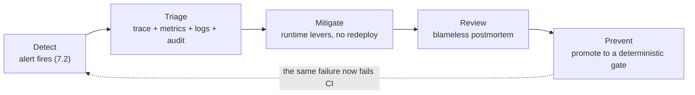
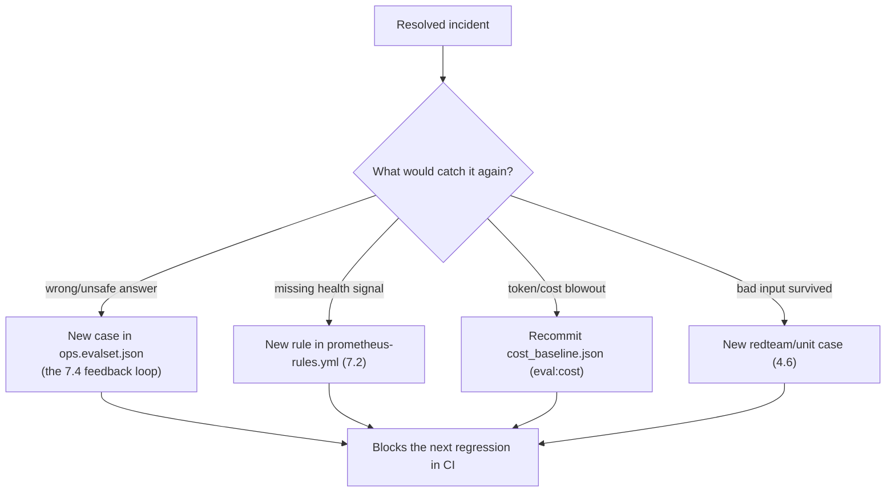

# 7.7. Incident Response

!!! abstract "In one glance"

    - **You will:** Cause one incident on purpose, walk the signals in order, write the postmortem, and turn the fix into a check that runs without you.
    - **You need:** [7.2. Monitoring](./7.2.%20Monitoring.md) and [7.3. Costs](./7.3.%20Costs.md) finished, with the host observability stack still running.
    - **Time:** about 35 minutes, hands-on.

## Why does the agent need its own incident response?

**Until now the agent triaged incidents. This page is about the agent _being_ the incident.**

The reference agent spends the whole course triaging incidents for a fictional service. The agent is now a running Kubernetes workload ([Chapter 6](../6.%20Platform/)), and a workload has incidents of its own. Six symptoms all mean the agent itself is misbehaving, not the platform it watches:

- An **error-budget burn**: failures eating the small allowance a 99% success target leaves.
- A latency regression.
- A spike of neutralized injections.
- A run of schema failures.
- A cost blowout.
- A stream of thumbs-down feedback.

The previous pages each own one signal. This one connects them into the loop an on-call engineer actually runs: **detect → triage → mitigate → review → prevent**.

The last step is the one people skip. An incident is not closed when service is restored. It is closed when a deterministic check would catch it again — a **gate**: a test, an eval case, an alert, or a baseline that the earlier chapters can enforce forever. That is what keeps the [AgentOps loop](../0.%20Overview/0.2.%20AgentOps.md) from leaking.



## How do you break it on purpose?

Cause one small, safe incident now, so the rest of the page has something real to walk.

Set `AGENT_MAX_TOKENS_PER_SESSION=1` in the gitignored `.env` at the repository root, then start a session and send two turns:

```bash
cd agents/python
mise run run
```

The first turn still calls the model and answers, because a fresh session has spent nothing yet. The second turn is refused before any model call, with `error_code="TOKEN_BUDGET_EXHAUSTED"` and a message naming the variable to raise. That refusal is your induced capacity incident, exactly as [7.3. Costs](./7.3.%20Costs.md) describes it.

!!! warning "Common mistakes"

    - **Sending only one turn.** `enforce_token_budget` refuses once the session's spent tokens reach the limit, and a fresh session starts at zero. The first turn always reaches the model. Send two.
    - **Setting the variable where the agent never reads it.** Only the configuration and model-backed tasks load the root `.env`. Run `mise run config:check` from `agents/python` to print the configuration the agent actually resolved.

## What counts as an incident for the agent itself?

The shipped alert rules already name most of them. Each maps to a first signal and the page that owns it:

| Fired alert                      | What it means                                          | Read first                                            |
| -------------------------------- | ------------------------------------------------------ | ----------------------------------------------------- |
| `AgentErrorBudgetBurn`           | Spans are failing faster than the 99% budget allows    | [7.2. Monitoring](./7.2.%20Monitoring.md) → the trace |
| `AgentTurnLatencyP95High`        | Span p95 exceeds 15s — model, tool, or hardware        | [7.1. Tracing](./7.1.%20Tracing.md) span breakdown    |
| `AgentInjectionNeutralizedSpike` | Guardrails neutralized an unusual burst of injections  | [4.6. Security](../4.%20Quality/4.6.%20Security.md)   |
| `AgentTriageSchemaFailures`      | Structured reports are failing `TriageReport` schema   | [4.0. Typing](../4.%20Quality/4.0.%20Typing.md)       |
| `AgentTokenTelemetryMissing`     | Spans flow but no token counters — broken cost signal  | [7.3. Costs](./7.3.%20Costs.md)                       |
| `ObservabilityCollectorDown`     | Prometheus cannot scrape the collector — you are blind | [7.2. Monitoring](./7.2.%20Monitoring.md)             |

Two more classes never page you, because they are judgements rather than thresholds: a quality incident and a cost incident. Treat both as first-class incidents anyway.

??? note "Deeper: the two incidents nothing will page you about"

    Two incident classes have no alert because they are judgements, not thresholds: a **quality** incident (a cluster of thumbs-down [feedback](./7.4.%20Feedback.md) or judge disagreement on answers that are wrong, not just terse) and a **cost** incident (a prompt or model change that quietly doubled tokens, caught by the [`eval:cost`](../4.%20Quality/4.4.%20Evaluations.md#how-do-you-catch-a-correct-but-expensive-regression) baseline rather than a live gauge). Treat both as first-class incidents even though nothing pages you.

## Which signals do you walk, in order?

Triage is a fixed walk across the three pillars plus the audit trail, not a hunt. The signals already join on one identifier — the trace id — so each step narrows the next:

1. **Metric** — confirm the alert is real and scope it: is the error ratio or p95 rising for every turn or one tool? ([7.2. Monitoring](./7.2.%20Monitoring.md))
1. **Trace** — open one failing turn in MLflow and read the span tree: which model or tool span failed, retried, or ran long, and what were its token counts? ([7.1. Tracing](./7.1.%20Tracing.md))
1. **Logs** — pivot to the correlated Loki logs for that window for the error text the span only summarizes. ([the collector fans logs to Loki](./index.md))
1. **Audit** — if any state changed, read the append-only audit row: who approved which write, with what rationale, against which incident. ([7.6. Governance](./7.6.%20Governance.md))

While you walk, the blast radius is already bounded. Every state-changing tool required human approval. So an agent incident can waste tokens, mislead, or fail, but it cannot have silently mutated production data without an audit row naming the approver.

Owned by [4.5. Guardrails](../4.%20Quality/4.5.%20Guardrails.md).

## What can you change to mitigate without a redeploy?

Most agent incidents are mitigated by configuration, not code, because the highest-leverage surfaces are already externalized. Each row below is a runtime lever, in rough order of reach:

| Symptom                                                                                           | Lever                                                                                                                                                              | Setting                                                      | Read more                                                                                                                   |
| ------------------------------------------------------------------------------------------------- | ------------------------------------------------------------------------------------------------------------------------------------------------------------------ | ------------------------------------------------------------ | --------------------------------------------------------------------------------------------------------------------------- |
| Bad state changes: a compromised session, a prompt gone wrong, a change window you must not touch | **Freeze every write.** Both guarded actions refuse before approval while reads keep working, so triage continues while nothing can mutate.                        | `AGENT_WRITES_DISABLED=true`                                 | [4.5. Guardrails](../4.%20Quality/4.5.%20Guardrails.md#how-do-you-freeze-every-write-instantly-during-an-incident)          |
| The incident started after a prompt change                                                        | **Roll back the instruction.** Pin the previous registry version: an instant revert with no image rebuild.                                                         | `AGENT_PROMPT_URI=prompts:/agentops-agent-instruction/N`     | [4.4. Evaluations](../4.%20Quality/4.4.%20Evaluations.md#how-do-you-version-pin-and-roll-back-the-instruction)              |
| Runaway cost, or a conversation that keeps growing                                                | **Cap the resource envelope** now, not at the next deploy. Sessions end with an actionable message; long conversations are trimmed rather than silently truncated. | `AGENT_MAX_TOKENS_PER_SESSION`, `AGENT_MAX_HISTORY_MESSAGES` | [3.4. Memory](../3.%20Capabilities/3.4.%20Memory.md#how-do-you-bound-the-history-automatically)                             |
| An opt-in path is misbehaving                                                                     | **Narrow the surface.** Fall back to the deterministic keyword scorer, or route reads back off a failing MCP gateway.                                              | `AGENT_SEMANTIC_RETRIEVAL=false`                             | [3.3. MCP](../3.%20Capabilities/3.3.%20MCP.md#what-changes-when-you-flip-agent_mcp_url)                                     |
| A read dependency is hard down                                                                    | **Stop paying the full retry budget** on every doomed call.                                                                                                        | `AGENT_CIRCUIT_BREAKER_ENABLED=true`                         | [4.5. Guardrails](../4.%20Quality/4.5.%20Guardrails.md#how-does-the-agent-shed-load-when-a-dependency-stays-down)           |
| The model endpoint is down and you have a validated smaller model                                 | **Fail over to it.**                                                                                                                                               | `AGENT_MODEL_FALLBACK`                                       | [5.4. Model Gateway](../5.%20Gateway/5.4.%20Model%20Gateway.md#how-does-the-agent-fail-over-when-the-primary-model-is-down) |
| The cause is code, not configuration                                                              | **Roll back the release.** The immutable image tag and release lineage make redeploying the previous digest the last, cleanest lever.                              | the previous image digest                                    | [7.0. Reproducibility](./7.0.%20Reproducibility.md)                                                                         |

Freezing every write is the fastest blast-radius cut you have, which is why it is first. Record which lever you pulled and when: that timestamp is the first line of the postmortem.

## How do you write a blameless postmortem?

Keep it short, factual, and about the system, not the person who shipped the change. Five sections carry it:

1. **Impact** — what degraded, for how long, and for whom.
1. **Timeline** — the alert, the trace, and the lever you pulled, each with a time.
1. **Root cause** — the one change or condition, tied to evidence.
1. **What caught it, and what didn't** — the input to Prevent.
1. **Actions** — one owner and one gate per line.

The fourth section is the one that matters. An incident that a cheaper layer _should_ have caught is really a gap in that layer, and naming it is how the layer improves.

??? note "Deeper: the full template, and one filled in"

    A usable template for this agent:

    ```markdown
    # Postmortem: <short title> (<date>)

    ## Impact

    What degraded, for how long, and for whom (e.g. "structured reports failed schema validation for 40 min; on-call saw empty triage output").

    ## Timeline

    - HH:MM AgentTriageSchemaFailures fired
    - HH:MM Trace <id> showed the model omitting a required field
    - HH:MM Pinned prompt version N-1 (AGENT_PROMPT_URI); alert cleared

    ## Root cause

    The one change or condition that produced the impact, tied to evidence: trace id(s), the audit row, the fired alert, the release/prompt version.

    ## What caught it, and what didn't

    Which signal surfaced it, and which gate should have caught it earlier but did not — this section is the input to Prevent.

    ## Actions (owner, gate)

    - [ ] New eval case reproducing the failure on seed data — <owner>
    - [ ] Alert / test / cost baseline that would catch a recurrence — <owner>
    ```

    The same template filled in, for the schema-failure incident its own timeline sketches:

    ```markdown
    # Postmortem: TriageReport schema failures after a prompt change (2026-03-14)

    ## Impact

    Structured reports failed schema validation for 40 min; on-call saw empty triage output. Read-only questions kept answering normally.

    ## Timeline

    - 09:12 AgentTriageSchemaFailures fired
    - 09:20 Trace 4f9c1e showed the model omitting the required severity field
    - 09:26 Pinned AGENT_PROMPT_URI to prompts:/agentops-agent-instruction/4; alert cleared 09:34

    ## Root cause

    Prompt version 5 reworded the report section and dropped the sentence naming every required field, so the model stopped emitting severity. TriageReport sets extra="forbid" and severity has no default, so every report failed validation.

    ## What caught it, and what didn't

    - Caught it: AgentTriageSchemaFailures, a few minutes after the first failed turn.
    - Did not catch it: the eval set had no case asserting a complete TriageReport, so the prompt change passed CI unchallenged.

    ## Actions (owner, gate)

    - [ ] New eval case asserting every TriageReport field on seed incident INC-002 — agent owner
    - [ ] No new alert: AgentTriageSchemaFailures already covers the symptom — on-call
    ```

## How do you turn the incident into a permanent gate?

This is the step that closes the loop, and it reuses machinery from the earlier chapters rather than inventing anything. Pick the cheapest layer that would have caught the failure:



Reproduce the behavior on the committed seed with `mise run data:reset`. Never paste a real production conversation into the repository. Transcribe the _behavior_ onto sanitized seed data, exactly as the [feedback loop](./7.4.%20Feedback.md#how-does-feedback-improve-the-agent) prescribes.

Each incident class has one cheapest gate:

- A quality incident becomes a new deterministic eval case.
- A missing health signal becomes a new Prometheus rule.
- A cost incident becomes a recommitted **cost baseline** — the per-case token and model-call counts `eval:cost` compares against, in `cost_baseline.json`.
- A bad input that reached a tool becomes a new deterministic red-team case.

The incident is closed only when that gate is green on `main`. The same failure would now fail a pull request before it ever reached production again.

## What proves this page worked?

Run one incident end to end on the local stack:

1. Induce a capacity incident: from `agents/python`, start a session with `AGENT_MAX_TOKENS_PER_SESSION=1` set and send two turns. The second is refused with `TOKEN_BUDGET_EXHAUSTED`. Observe the refusal message and the `agentops.tokens` counter, exactly as [7.3. Costs](./7.3.%20Costs.md) describes.
1. Walk the signals: find the turn's trace ([7.1. Tracing](./7.1.%20Tracing.md)), confirm the token attributes on its spans, and confirm no audit row was written because no write was approved ([7.6. Governance](./7.6.%20Governance.md)).
1. Write the five-section postmortem above — impact, timeline, root cause, what caught it, actions.
1. Promote one action to a gate: add a unit test asserting `enforce_token_budget` refuses past the limit (or a Prometheus rule that would alert on it), and confirm it is green.

**You are done when:**

- The second turn of your budgeted session was refused with `error_code="TOKEN_BUDGET_EXHAUSTED"`, and the first was not.
- You can open that turn's trace in MLflow and read `agentops.tokens.session.total` off its spans.
- The `audit_log` table gained no row, because no write was approved.
- Your postmortem fills all five sections, including "what caught it, and what didn't".
- The check you added for that failure is green, and it would fail a pull request that reintroduced the failure.

You have completed the loop when the condition that caused your induced incident is covered by a check that runs without you. That is the whole point of operating an agent instead of merely running one.

Continue to [Community](../8.%20Community/index.md) when that check is green on `main`.
