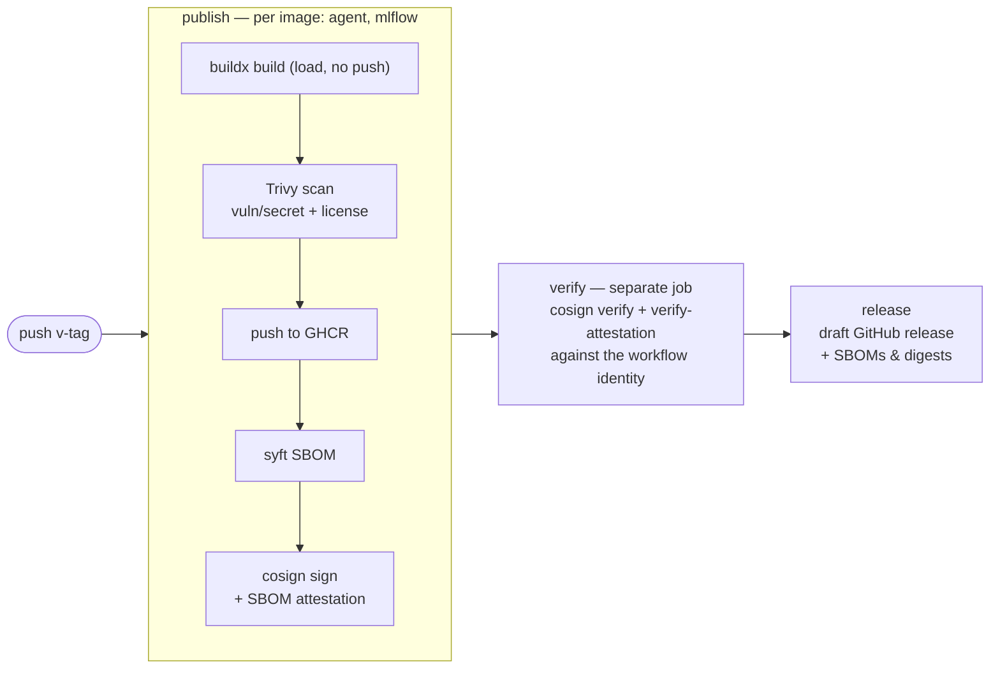

# 8.2. Releases

!!! abstract "In one glance"

    - **You will:** See how a version number, a changelog entry, a tag, and a signed image are tied together, and check that this repository's version metadata still agrees.
    - **You need:** A clone and `mise install`; you will not tag a release of this repository.
    - **Time:** about 12 minutes, reference.

## What is a release?

This repository's newest release is `v0.1.1`. That one name covers four things at once:

- A `v`-prefixed Git tag on the commit that shipped it.
- The dated `## [0.1.1] - 2026-07-24` section in `CHANGELOG.md`.
- The same version in `pyproject.toml`, `agents/python/pyproject.toml`, and `CITATION.cff`.
- The two container images (`agent` and `mlflow`) that tag publishes to GHCR, GitHub's container registry.

More generally, a release is a deliberately tagged snapshot plus evidence about its code, course, agent package, images, data, infrastructure, and known limitations. A version identifies those artifacts; it cannot guarantee that an external hosted model behaves identically forever.

You will not tag this repository. Read the rest of this page as the release pattern to copy into your own project, and run only the checkpoint at the end.

## How is the project versioned?

Use [Semantic Versioning](https://semver.org/):

1. **MAJOR** for incompatible public course/application/deployment contract changes.
1. **MINOR** for backward-compatible capabilities or chapters.
1. **PATCH** for backward-compatible fixes and clarifications.

The repository is `0.1.1`, which signals that contracts may still change before 1.0. Root `pyproject.toml`, `agents/python/pyproject.toml`, and `CITATION.cff` must agree for a release.

`mise run check:release-metadata` enforces that agreement, requires the newest dated changelog heading and citation release date to match, and can validate an expected `v`-prefixed tag. The tag workflow runs that check before building or pushing either image, so a mistyped tag cannot publish artifacts with a different package/A2A version.

## How is the changelog maintained?

[`CHANGELOG.md`](https://github.com/MLOps-Courses/agentops-open-course/blob/main/CHANGELOG.md) follows [Keep a Changelog](https://keepachangelog.com/en/1.1.0/). Add user-visible work under `Unreleased`; move it into a dated version only during an intentional release. Do not generate claims from commit prefixes without reviewing the actual diff.

The repository does not currently ship a git-cliff configuration/task. If automation is added later, it must preserve curated entries and pass the same docs checks rather than replacing review.

## What must pass before tagging?

A tag is worth cutting only when this whole gate is green from a clean checkout:

```bash
mise run format
mise run check
mise run test
mise run scan
mise run check:release-metadata
# the script also accepts an explicit tag, which is how the tag workflow calls it:
# python3 scripts/check_conventions.py release-metadata "v$(awk -F '\"' '/^version = / { print $2; exit }' pyproject.toml)"
test -z "$(git status --porcelain)"
```

Four more requirements sit alongside that block, and a fifth applies only to a publication release:

1. **Render both Kubernetes overlays** — `mise run check:infra`, which the `mise run check` above already includes.
1. **Inspect dependency and image locks** for anything you did not intend to ship.
1. **Run live evaluations on explicitly recorded models when behavior changed** — `mise run eval` from `agents/python/`.
1. **Review release notes** for OSS, cloud, cost, and security overclaims.
1. **A publication release** additionally requires the anonymous clone/site/source-link gate from [8.4. Documentation](./8.4.%20Documentation.md).

## How would a maintainer publish a release?

These six steps belong to whoever holds push rights; you are reading them, not running them.

1. Choose the SemVer change from the public contract diff.
1. Update all version metadata and locks.
1. Move reviewed changelog entries out of `Unreleased` with the release date.
1. Run the complete release gate and verify the documentation site locally.
1. Commit the release metadata, create an annotated `v`-prefixed tag, and push it.
1. Publish a GitHub release from that tag with the relevant changelog section and artifact digests.

No release is created merely by merging to `main`; the docs site deployment and a versioned release are separate events.

## What does the release workflow publish?

Pushing a `v`-prefixed tag runs [`release.yml`](https://github.com/MLOps-Courses/agentops-open-course/blob/main/.github/workflows/release.yml), which turns the tag into verifiable artifacts. Four of its words are worth pinning down first:

- **buildx** — Docker's builder, used here to build the image without pushing it.
- **SBOM** — a machine-readable inventory of everything inside an image, generated by **syft** ([0.7. Glossary](../0.%20Overview/0.7.%20Glossary.md#sbom)).
- **keyless signing** — cosign binds the signature to the workflow that produced it, so there is no signing key to leak.
- **attestation** — that SBOM, signed and attached to the image, so the inventory travels with the artifact.

The workflow then does six things:

1. Builds the agent (`agents/python/Dockerfile`) and MLflow (`infra/mlflow/Dockerfile`) images with buildx.
1. Scans each image with Trivy before any push: vulnerabilities/secrets fail at HIGH/CRITICAL, and licenses fail at UNKNOWN/HIGH/CRITICAL outside the reviewed OSS policy in `trivy.yaml`.
1. Pushes to `ghcr.io/mlops-courses/agentops-open-course/{agent,mlflow}` tagged with the version.
1. Generates an SPDX SBOM with syft, signs the image keyless with cosign (GitHub OIDC — no stored key, no secret beyond the built-in token), and attaches the SBOM as an attestation.
1. Verifies the signature and attestation from a separate job against the expected workflow identity, so the run proves its own supply-chain claim.
1. Uploads SBOMs and image digests to a draft GitHub release for the tag.

Those six steps run as three jobs, `publish` then `verify` then `release`, and nothing is pushed before the scans pass:



??? note "Deeper: why does a separate job re-verify the signature?"

    Those steps are three gated jobs over a two-image matrix, and the split is the point: a separate `verify` job re-checks the signature and SBOM attestation the `publish` job produced, so the pipeline attests to itself rather than trusting its own earlier step.

The workflow does not replace the manual gate above: a maintainer still curates the changelog notes and publishes the draft deliberately. Consumers verify images as shown in [6.1. Containers](../6.%20Platform/6.1.%20Containers.md).

## How does Dependabot propose dependency updates?

[`dependabot.yml`](https://github.com/MLOps-Courses/agentops-open-course/blob/main/.github/dependabot.yml) opens dependency pull requests every Monday. Dependabot is native to GitHub: no token, no app to install, no workflow of its own to run.

It watches six targets, because Dependabot takes no globs and each project needs its own entry: GitHub Actions, the three `uv` projects (the docs root, `agents/python`, `infra/mlflow`), and the two Dockerfiles. Routine minor and patch bumps arrive as one grouped PR per project with a `chore(deps):` subject; majors, plus `google-adk` and `mlflow`, are excluded from the group so they arrive on their own. Nothing auto-merges — the offline gate cannot see model or protocol drift, so every PR goes through the local validation below.

!!! warning "Dependabot does not see every pin in this repository"

    It covers packages and Dockerfile base images. It does **not** watch the `[tools]` pins in `mise.toml` and `mise.lock`, the Helm chart versions in `infra/helmfile.yaml`, the image digests inside `infra/k8s/**`, or the Wolfi `apk` pins in the agent Dockerfile.

    Those four are updated by hand, and the quarterly [docs-freshness issue](https://github.com/MLOps-Courses/agentops-open-course/blob/main/.github/ISSUE_TEMPLATE/docs-freshness.md) is what makes sure someone looks. The coordinated-pins checklist below is the other half of that discipline.

## How does a maintainer validate a dependency update?

A dependency PR is validated on a laptop, on the PR branch, before it merges — the same gate a release runs.

1. Check out the PR branch and run `mise install`; a `mise.toml` tool bump is a hand-made change, and it needs the refreshed `mise.lock` committed with it.
1. Run the full offline gate: `mise run format`, `mise run check` (includes rendering both Kubernetes overlays), `mise run test`, and `mise run scan`.
1. For behavior-affecting bumps — ADK, model wiring, agentgateway — also run `mise run eval` and `mise run eval:mlflow` from `agents/python/` against an explicitly recorded model, and compare scores with the previous baseline.
1. For platform pins (agentgateway, kagent, collector), smoke-test on k3d: `mise run cluster:start`, `mise run platform:install`, `mise run platform:dev`, then exercise the gateway endpoints.
1. To roll back, revert the merge commit and re-run the gate; published images are immutable per digest, so deployments roll back by pinning the previous verified digest.

## Which pinned components must move together?

Six components are pinned in more than one file, so bumping one file alone leaves the repository inconsistent. The list below is the reviewer's checklist for an upgrade PR; open it when you take one.

??? note "Deeper: the six coordinated pins"

    The coordinated pins from `AGENTS.md` cannot be bumped file-by-file:

    1. **Google ADK**: the compatible range in `agents/python/pyproject.toml` and the exact pin in its `uv.lock`.
    1. **agentgateway**: the mise-managed binary in the root `mise.toml` and the image digest in `infra/k8s/base/agentgateway.yaml`, across all three data-plane profiles.
    1. **kagent**: the `kagent-crds` and `kagent` charts in `infra/helmfile.yaml` stay on the same version, and API resources remain `v1alpha2`.
    1. **MLflow**: the `agents/python` dependency and the `infra/mlflow` lock, plus the local build tag `agentops-mlflow:<version>` in `infra/observability/compose.yaml` and the root `build:mlflow-image` task — the tag is not a registry image, so update it by hand.
    1. **OpenTelemetry Collector**: the same contrib digest in `infra/observability/compose.yaml` and `infra/k8s/base/otel-collector.yaml`.
    1. **Python 3.13**: `requires-python` in the pyprojects and both image base pins.

Dependabot sees only the package half of most of these rows; every other half is hand-maintained, which is exactly why the checklist exists. After merging an upgrade that changes an image, cut the next release tag so the published GHCR artifacts, signatures, and SBOMs match the repository again (see the release workflow above).

## Why use v-prefixed tags?

A `v`-prefixed tag such as `v0.1.1` clearly distinguishes a version tag from other Git refs. GitHub and release tooling widely understand the convention. Choose one convention and keep package metadata, changelog headings, tag, and release title consistent.

## What proves this page worked?

Two commands, offline and done in seconds:

```bash
git tag --list 'v*' --sort=v:refname | tail -1
mise run check:release-metadata v0.1.1
```

Pass the tag the first command prints into the second. Together they verify that the latest dated entry in `CHANGELOG.md` matches the newest `v`-prefixed tag (currently `v0.1.1`) and that `pyproject.toml`, `agents/python/pyproject.toml`, and `CITATION.cff` all carry that version.

A consistent repository prints `release metadata: v0.1.1 (2026-07-24) is consistent`. A drifted one names the mismatch and exits non-zero, for example `release metadata: tag v0.2.0 does not match source version v0.1.1`.

Any new release requires explicit maintainer intent and the full gate above.

**You are done when:**

- `git tag --list 'v*' --sort=v:refname | tail -1` prints `v0.1.1`, the same version as the newest dated `CHANGELOG.md` heading.
- `mise run check:release-metadata v0.1.1` prints the `is consistent` line and exits zero.
- You can name the three files that must agree on the version, without opening them.
- You can say what the tag adds that a commit does not: scanned images, an SBOM, a signature, and a job that verifies both.

Continue to [8.3. Templates](./8.3.%20Templates.md) when you could reproduce this release pattern — tag, changelog entry, matching metadata, signed image — in a repository of your own.
