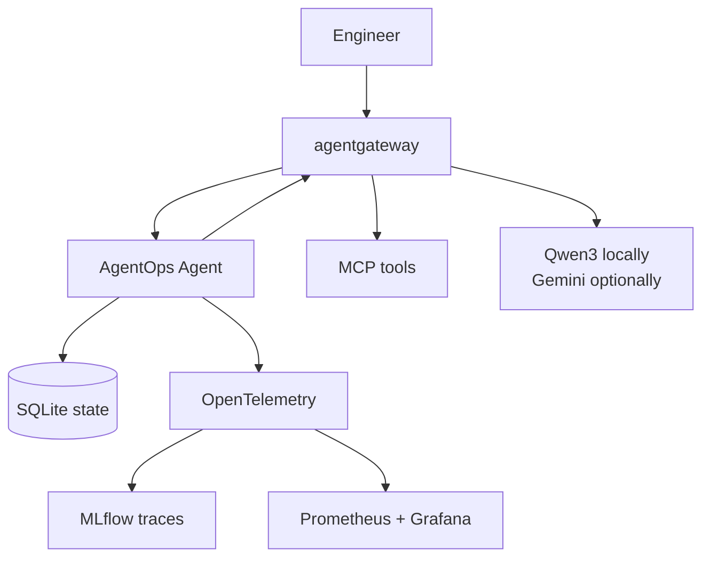
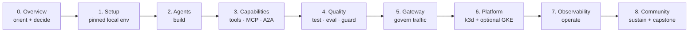

# AgentOps Open Course

Learn from one completed **AgentOps Agent**, from its first local model call to an observable Kubernetes workload. Every chapter inspects and runs the same reference, so concepts stay connected to code, tests, policy, and operations. The capstone then guides you through replacing the fictional incident domain with your own agent platform.

!!! abstract "In one glance"

    - **You will:** Build, test, secure, deploy, and operate one production-shaped AI agent, then replace its domain with your own.
    - **You need:** A Unix-like shell (Linux, macOS, or WSL2), git, and basic Python. [mise](https://mise.jdx.dev/) and [Ollama](https://ollama.com/download) are installed below. No account, no API key, no cloud project.
    - **Time:** about 12 to 19 focused hours to read the course and clear each chapter's checkpoint.

## Can you get the agent talking before you read anything?

Yes, and it is the best way to start. This is the whole sequence, from an empty directory to a conversation:

```bash
# 1. Install the two things mise cannot install for you.
curl -fsSL https://mise.run | sh          # then follow its instructions to activate your shell
curl -fsSL https://ollama.com/install.sh -o /tmp/ollama-install.sh
sh /tmp/ollama-install.sh                 # macOS and Windows: use the ollama.com/download installer

# 2. Get the course and its pinned toolchain.
git clone https://github.com/MLOps-Courses/agentops-open-course.git
cd agentops-open-course
mise install         # the pinned CLIs declared in mise.toml
mise run install     # the Python virtualenvs and the git hooks
mise run test        # the offline suite — no model, no network calls

# 3. Get a model, then talk to the agent.
ollama pull qwen3:4b-instruct   # ~2.5 GB, Apache-2.0 open weights
mise run doctor:model           # probes that the model is being served
cd agents/python
mise run run                    # interactive agent on your machine
```

Ask it `List the open incidents`. It should answer with **INC-002, INC-005, and INC-010** — three ids that exist in the committed dataset, not three it invented. Getting those ids means it read the data through a tool instead of guessing. That loop, made reliable, governed, and observable, is the entire course.

!!! tip "What to expect the first time"

    Four of those commands download things: mise, Ollama, the pinned toolchain and Python environments, and the model. Budget around twenty minutes, most of it waiting. The first model turn on a CPU can take tens of seconds while the weights load — that is normal, not a hang.

    `mise run run` prints the agent's answer, not the tool calls behind it. To watch the calls themselves, run `mise run web` instead and open the Events timeline.

    A command that fails? [1.0. System](./1.%20Setup/1.0.%20System.md) installs the toolchain step by step, and [0.6. Troubleshooting](./0.%20Overview/0.6.%20Troubleshooting.md) matches the symptom to the fix.

!!! note "Prefer to understand before you install?"

    Start at [0.0. Course](./0.%20Overview/0.0.%20Course.md) instead. Chapter 0 is read-only: no account, no command, no cost. Keep [0.7. Glossary](./0.%20Overview/0.7.%20Glossary.md) open in a second tab — every course term is defined there in one line, with a link to the page that introduces it.

## What will you be able to do?

- Design an agent only where model autonomy is worth its latency and risk.
- Build typed ADK agents with tools, Agent Skills, MCP, memory, workflows, and A2A.
- Test behavior offline, evaluate model-backed trajectories, redact PII, and require human approval for writes.
- Route model, tool, and agent traffic through agentgateway with one stable application contract.
- Run the same container on local k3d or a small GKE lab managed by kagent.
- Trace the system in self-hosted MLflow and monitor it with OpenTelemetry, Prometheus, and Grafana.

You are not expected to recognize those names yet. Each one gets its own chapter, and the glossary defines every one of them in a single line.

## What is the system you will inspect and extend?



The bundled incident, log, runbook, and skill data is immutable. A runtime copy receives mock state changes and append-only audit records, which keeps each exercise resettable and safe.

You do not reconstruct this system file by file. `main` is the working reference, and each checkpoint asks you to understand, verify, or deliberately change one boundary.

## How does the course progress?

The chapter order is the AgentOps lifecycle: you build the agent, prove it, govern its traffic, deploy it, operate it, then sustain it. Each stage unlocks a heavier prerequisite tier, so nothing forces a model, gateway, cluster, or cloud on you before the chapter that needs it.



## Where should you start?

New to agent systems? Read the chapters in order. Already shipping LLM applications? Use the outcomes below as a map:

| Chapter                                   | You will leave with                                                      |
| ----------------------------------------- | ------------------------------------------------------------------------ |
| [0. Overview](./0.%20Overview/)           | A clear AgentOps lifecycle, architecture, and provider choice.           |
| [1. Setup](./1.%20Setup/)                 | A pinned local workspace and an offline verification checkpoint.         |
| [2. Agents](./2.%20Agents/)               | A first ADK agent with explicit configuration and session semantics.     |
| [3. Capabilities](./3.%20Capabilities/)   | Typed tools, least-privilege skills, MCP, retrieval, workflows, and A2A. |
| [4. Quality](./4.%20Quality/)             | Branch-covered tests, evaluations, guardrails, and security regressions. |
| [5. Gateway](./5.%20Gateway/)             | Governed MCP, A2A, and model traffic through agentgateway.               |
| [6. Platform](./6.%20Platform/)           | Reproducible k3d and optional GKE deployments with kagent.               |
| [7. Observability](./7.%20Observability/) | Self-hosted tracing, metrics, evaluation, feedback, and audit evidence.  |
| [8. Community](./8.%20Community/)         | A maintainable project and an evidence-backed capstone of your own.      |

Every page opens with the same "In one glance" block — what you will do, what you need first, and how long it takes — and ends with a checkpoint you can actually verify. Skim the glance block and skip a page when it is not for you today.

Those per-page times add up to about 29 hours. That is the figure for running every command on every page, including the optional ones; the 12 to 19 hours above is reading the course and clearing each chapter's checkpoint. Both are honest, and you choose which course you are taking.

## What does "open source" mean here?

Google ADK, agentgateway, kagent, MLflow, OpenTelemetry, Prometheus, Grafana, Ollama, the Apache-2.0 open-weight Qwen3 model, and the course code form the required open-source path. The optional Gemini API, Vertex AI, GKE, and repository/site hosting are proprietary services. They are integrations, not hidden requirements.

## How do you begin?

Run the quickstart above, or start reading at [0.0. Course](./0.%20Overview/0.0.%20Course.md). Every chapter ends with a checkpoint; Chapters 5-7 also include explicit verification and teardown steps. Finish by adapting the reference through [8.7. Capstone](./8.%20Community/8.7.%20Capstone.md).

The source repository is public at [MLOps-Courses/agentops-open-course](https://github.com/MLOps-Courses/agentops-open-course). To preview documentation changes locally, run `mise run serve` at `http://127.0.0.1:8000`.
